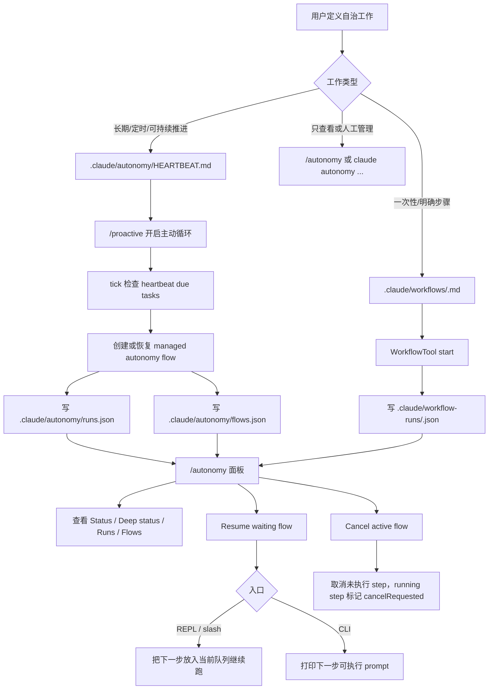
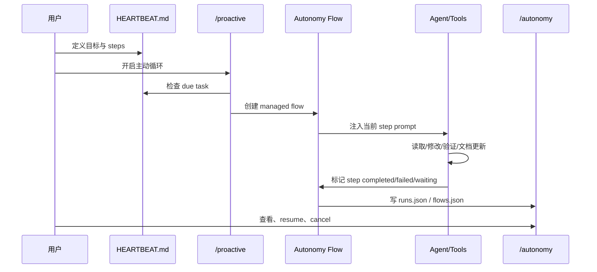

# Autonomy Management 使用指南

> 状态：完整实现，远端/订阅能力按运行条件生效  
> 主要入口：`/autonomy`、`/proactive`、`claude autonomy ...`、`.claude/autonomy/HEARTBEAT.md`、`.claude/workflows/*.md`

## 一、这是什么

Autonomy Management 是项目里的本地自治管理面。它不是单个工具，而是一组可持续工作的控制面：

- 自动 run/flow 记录：保存自动执行、managed flow step 的状态。
- `/autonomy` 面板：交互式查看和管理自治状态。
- `claude autonomy ...` CLI：在终端里查看、恢复、取消自治 flow。
- HEARTBEAT：把长期目标定义为会被 `/proactive` 自动发现的 managed flow。
- WorkflowTool：把一次性多步工作定义为 `.claude/workflows/*.md` 并持久化运行状态。
- Agent Teams / pipes / Remote Control / RemoteTrigger：作为自治系统可观测的执行与通信面。

## 二、整体流程图



## 三、推荐使用方式

### 方式 A：长期自治工作，使用 HEARTBEAT

适合：

- 长期加固某个能力。
- 每隔一段时间自动检查和推进。
- 希望系统在你不盯着时继续完成“检查 -> 实施 -> 验证 -> 文档”闭环。

创建文件：

```text
.claude/autonomy/HEARTBEAT.md
```

示例：

```md
# Autonomy Heartbeat

- name: autonomy-maintenance
  interval: 30m
  prompt: 持续推进自治管理能力，直到代码、测试、文档均可验收。
  steps:
    - name: inspect
      prompt: 检查 Agent Teams、autonomy CLI/panel、pipes、WorkflowTool、RemoteTrigger、Remote Control 的当前状态和文档是否一致。
    - name: implement
      prompt: 实施当前可安全完成的缺口，不询问用户，保持现有行为不倒退。
    - name: verify
      prompt: 运行聚焦测试、tsc、lint、diff check；失败则修复后重跑。
    - name: document
      prompt: 更新 docs/autonomous-management-capability-audit.md，把完成项、运行条件、实机验收项写清楚。
```

开启主动自治：

```text
/proactive
```

之后 proactive tick 会读取 HEARTBEAT，创建 managed flow，并按步骤推进。

### 方式 B：一次性多步工作，使用 WorkflowTool

适合：

- 有明确步骤。
- 不需要定时唤醒。
- 想记录 workflow run 状态。

创建文件：

```text
.claude/workflows/release-audit.md
```

示例：

```md
# Release Audit

- Inspect changed files and summarize risk.
- Run focused tests for changed modules.
- Run typecheck and lint.
- Update docs if behavior changed.
- Produce final verification summary.
```

在 REPL 里让模型启动：

```text
Use WorkflowTool to start workflow "release-audit".
```

WorkflowTool 会将状态保存到：

```text
.claude/workflow-runs/
```

`/autonomy` 面板中的 `Workflow runs` 会显示这些持久化 run。

### 方式 C：只查看或人工接管，使用 /autonomy

在 REPL 中输入：

```text
/autonomy
```

这会打开独立面板。基础子项包括：

| 子项 | 作用 |
| --- | --- |
| Overview | 查看 run/flow 总览和最近自动活动 |
| Full deep status | 输出所有本地自治健康状态 |
| Auto mode | 查看自动权限模式是否可用以及原因 |
| Runs summary | 查看 run 计数和最新 run |
| Recent runs | 查看最近 run 的 ID、触发器、状态和 prompt |
| Flows summary | 查看 managed flow 状态计数 |
| Recent flows | 查看最近 flow 的 ID、状态、当前 step 和目标 |
| Cron | 查看定时自治任务、持久性、循环与下一次运行 |
| Workflow runs | 查看 WorkflowTool 持久化 run 和当前 step |
| Teams | 查看 Agent Teams、teammate 后端、活跃状态和 open tasks |
| Pipes | 查看 UDS/named-pipe 和 LAN pipe registry |
| Runtime | 查看 daemon 和后台/交互会话 |
| Remote Control | 查看 bridge 模式、base URL、token 状态和 entitlement 提示 |
| RemoteTrigger | 查看远端 trigger 审计记录、失败数和最近调用 |

操作：

```text
↑ / ↓ 选择
Enter 执行当前子项
Esc 关闭
```

如果有最近的 flow，面板还会追加：

- `Flow <id>`：查看详情
- `Resume <id>`：恢复等待中的 flow
- `Cancel <id>`：取消 active flow

## 四、CLI 使用

CLI 适合脚本、CI、远程 shell 或不在 REPL 面板中的时候。

```bash
claude autonomy status
claude autonomy status --deep
claude autonomy runs 10
claude autonomy flows 10
claude autonomy flow <flow-id>
claude autonomy flow cancel <flow-id>
claude autonomy flow resume <flow-id>
```

本地开发可直接用 Bun 入口验证：

```bash
bun run src/entrypoints/cli.tsx autonomy status --deep
```

### CLI resume 和 REPL resume 的区别

REPL：

```text
/autonomy flow resume <flow-id>
```

会把下一步放入当前 REPL 队列继续执行。

CLI：

```bash
claude autonomy flow resume <flow-id>
```

会创建或恢复对应 run，并打印下一步可执行 prompt。CLI 进程会退出，不能依赖 REPL 内存队列。

## 五、执行闭环图



## 六、文件与状态位置

| 路径 | 说明 |
| --- | --- |
| `.claude/autonomy/HEARTBEAT.md` | 长期自治目标定义 |
| `.claude/autonomy/runs.json` | 自动 run 记录 |
| `.claude/autonomy/flows.json` | managed flow 状态 |
| `.claude/workflows/*.md` | 一次性 workflow 定义 |
| `.claude/workflow-runs/*.json` | WorkflowTool run 状态 |
| `.claude/scheduled_tasks.json` | Cron 定时任务 |
| `.claude/remote-trigger-audit.jsonl` | RemoteTrigger 本地审计 |
| `~/.claude/teams/` | Agent Teams 配置和 inbox |
| `~/.claude/pipes/` | pipe registry 与本机 IPC 状态 |
| `~/.claude/sessions/` | 会话 PID registry |

## 七、常见工作模板

### 1. 自动完成代码加固

```md
- name: code-hardening
  interval: 1h
  prompt: 持续加固当前代码变更，直到测试和文档都通过。
  steps:
    - name: inspect
      prompt: 检查当前 git diff、相关模块、测试覆盖和文档状态。
    - name: implement
      prompt: 修复明确缺口，避免无关重构。
    - name: verify
      prompt: 运行聚焦测试、tsc、lint、diff check。
    - name: document
      prompt: 更新相关 docs，记录完成状态和剩余风险。
```

### 2. 自动维护文档

```md
- name: docs-sync
  interval: 2h
  prompt: 保持功能文档和当前代码实现一致。
  steps:
    - name: audit
      prompt: 对比 docs/features 和源码入口，找出过时表述。
    - name: update
      prompt: 修改文档，补证据路径和真实状态。
    - name: verify
      prompt: 运行必要的文档相关检查和 git diff --check。
```

### 3. 等待外部结果后继续

```md
- name: wait-for-ci
  interval: 15m
  prompt: 等待 CI 或外部任务完成后继续修复。
  steps:
    - name: check
      prompt: 检查 CI 或外部状态，若未完成则说明等待原因。
    - name: fix
      prompt: 如果有失败，修复明确错误并重跑相关测试。
      waitFor: manual
```

## 八、当前边界

- Autonomy 管理面已经完整：面板、CLI、runs/flows、deep status、resume/cancel 都可用。
- HEARTBEAT/proactive 是长期自治的推荐入口。
- WorkflowTool 是一次性 workflow 的推荐入口。
- Remote Control、CCR、RemoteTrigger 属于完整实现但需要订阅/远端运行条件。
- Windows Terminal pane、LAN 多机 pipes、KAIROS assistant attach 更适合做实机验收，不阻塞本地自治管理使用。

