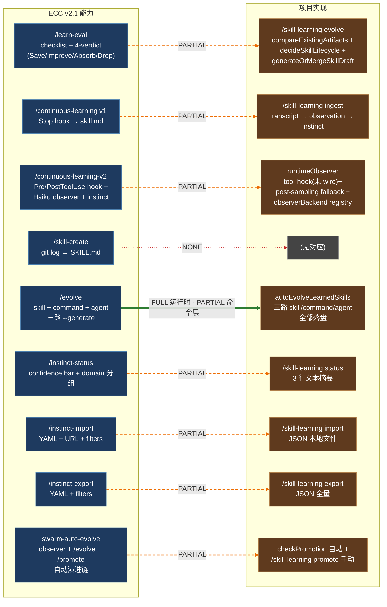
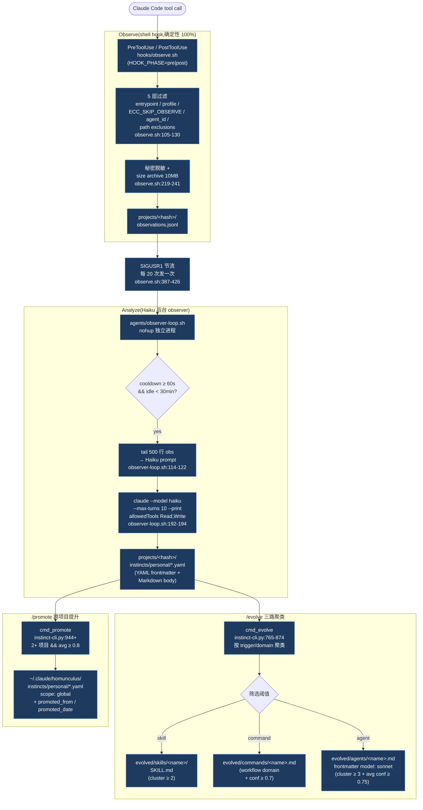

# Skill Learning — ECC 1:1 对比

> 原初稿基准:HEAD `5feb4103c34c41ea3547da137f184d45d340ef50` on branch `chore/lint-cleanup`, 2026-04-17, ECC `ecc-universal v1.9.0`(`skills/continuous-learning-v2/` 内部版本 `2.1.0`)。
>
> **2026-04-17 Refresh 记录(工作树脏,未提交)**:在原初稿之后,Task #1~#11(P0 全部 + P1 全部 + P2 全部,共 11 条实施任务)已全部 land,`bun test` 2927 pass / 0 fail。Task #14(META-M)即本轮附录图产出。本次只刷新"项目侧对应实现"部分的行号与 FULL/PARTIAL/GAP 评级;ECC 侧描述保持不变。Refresh 后实际有效锚点见各章节的`已更新 @ 2026-04-17`标注。
>
> **附录可视化图**(两张 Mermaid,META-M 产出)直接追加在文档末尾"文档元信息"之前,与文中矩阵和差距章节配合阅读。
>
> 本文档按 team-lead 要求做 ECC 能力与项目实现的逐项对照。不做价值判断,不下"应否采纳 ECC"的结论,只负责提供可追溯的事实对比。对应任务:`docs/features/skill-learning-ecc-parity-tasks.md` Task #13 + Task #14。

## Refresh 一览(对第二次核对的差异)

| 任务 | 状态 | 影响的评级条目 |
|---|---|---|
| #1 P0-1 gap 状态机 | completed | 差距 5(首次即 draft 风险)下调至 FULL,`skillGapStore.ts:88-125` 新增 pending→draft→active→rejected 四态机 |
| #2 P1-2 CJK bi-gram tokenizer | completed | `/continuous-learning-v2` 多语言维度、`/evolve` 聚类维度从 ❌/⚠️ 升为 ✅(`localSearch.ts:158-194`) |
| #3 P2-4 write-fixture 移除 | completed | `/continuous-learning-v2` 命令面移除 `write-fixture` case |
| #4 P0-2 outcome-aware confidence | completed | 置信度维度新增 outcome 加权(`instinctStore.ts:79-107`,success=+0.05/failure=-0.05/contradict=-0.1),`evidenceOutcome` 字段进入真实使用 |
| #5 P1-1 observer backend 接口 | completed | 差距 2 模式检测从单纯启发式升为 "启发式默认 + LLM backend 接口"(`observerBackend.ts` 71 行 + `llmObserverBackend.ts` stub),`sessionObserver.ts:24-34` heuristicObserverBackend 作为默认 |
| #6 P1-4 draft 命中计数 | completed | `prefetch.ts:206-212` 接入 `recordDraftHit`,draft → active 晋升可由 2 次命中触发 |
| #7 P1-3 命令面补齐 | completed | `skill-learning.ts:122-216` 新增 `promote`(支持 `gap <key>` / `instinct <id>`)+ `projects` 两个 case,`argumentHint` 已含 `promote\|projects`,`write-fixture` 早在 P2-4 已移除 |
| #8 P0-3 进化三路 | completed | 差距 3 从 GAP 升为 FULL(runtime),`evolution.ts:83-135` 三路 generator + `commandGenerator.ts` + `agentGenerator.ts` + `skillLifecycle.ts:63-80 compareExistingArtifacts` 泛化 + `runtimeObserver.ts:97-135` 三路全打通 |
| #9 P0-4 tool event hook | completed(接口层) | 差距 1 从 "只有 post-sampling" 升为 "tool event 优先 + post-sampling 兜底",`toolEventObserver.ts` 151 行 + `runtimeObserver.ts:52-68`;`src/Tool.ts` 主 dispatch 尚未 wire(见 `toolEventObserver.ts:22-28` `@todo`),生产路径仍以 fallback 为主 |
| #10 P2-1 自动 promote | completed | `promotion.ts:68+ checkPromotion`,`runtimeObserver.ts:138` 在 `autoEvolveLearnedSkills` 尾部自动调用(session 内幂等),差距 4 从 ❌ 升为 ✅ |
| #11 P2-2 反重复治理 | completed | `skillGenerator.ts:14/59-95` 新增 `DUPLICATE_SKILL_OVERLAP_THRESHOLD = 0.8` + `generateOrMergeSkillDraft` + `appendInstinctEvidenceToSkill`;`runtimeObserver.ts:103` 已换成 `generateOrMergeSkillDraft`,overlap ≥ 0.8 时走 `append-evidence`(把新 instinct 的 evidence 追加到现有 skill),否则走 `create` + `decideSkillLifecycle` |

## 目录

1. [基准声明](#基准声明)
2. [能力全景矩阵](#能力全景矩阵)
3. [逐项 1:1 对照](#逐项-11-对照)
   1. [`/learn-eval`](#1-learn-eval)
   2. [`/continuous-learning` (v1)](#2-continuous-learning-v1)
   3. [`/continuous-learning-v2`](#3-continuous-learning-v2)
   4. [`/skill-create`](#4-skill-create)
   5. [`/evolve`](#5-evolve)
   6. [`/instinct-status`](#6-instinct-status)
   7. [`/instinct-import`](#7-instinct-import)
   8. [`/instinct-export`](#8-instinct-export)
   9. [`swarm-auto-evolve`(ECC 侧无独立技能,实为 observer agent + /evolve + /promote 的运行时组合)](#9-swarm-auto-evolveecc-侧无独立技能实为-observer-agent--evolve--promote-的运行时组合)
4. [最大差距总结](#最大差距总结)

---

## 基准声明

| 基准项 | 值 |
|---|---|
| 项目 git SHA (HEAD) | `5feb4103c34c41ea3547da137f184d45d340ef50` |
| 项目分支 | `chore/lint-cleanup` |
| 项目最近 commit 主题 | `feat: 整合功能恢复与技能学习闭环` (2026-04-16) |
| ECC 插件 | `ecc-universal` (`C:\Users\12180\.claude\plugins\marketplaces\everything-claude-code\package.json`) |
| ECC 插件版本 | `1.9.0` |
| ECC `continuous-learning-v2` 内部版本 | `2.1.0` (见 `skills/continuous-learning-v2/SKILL.md:5`) |
| ECC `continuous-learning` (v1) 内部版本 | 无 frontmatter version 字段 |
| 对照日期 | 2026-04-17 |

对照用到的 ECC 源文件清单(全部以 `C:\Users\12180\.claude\plugins\marketplaces\everything-claude-code\` 为前缀):

- `skills/continuous-learning/SKILL.md`(v1)
- `skills/continuous-learning/config.json`(v1)
- `skills/continuous-learning/evaluate-session.sh`(v1)
- `skills/continuous-learning-v2/SKILL.md`(v2.1)
- `skills/continuous-learning-v2/config.json`(v2.1)
- `skills/continuous-learning-v2/hooks/observe.sh`(429 行 Shell)
- `skills/continuous-learning-v2/scripts/instinct-cli.py`(1426 行 Python)
- `skills/continuous-learning-v2/scripts/detect-project.sh`
- `skills/continuous-learning-v2/agents/observer.md`
- `skills/continuous-learning-v2/agents/observer-loop.sh`
- `skills/continuous-learning-v2/agents/start-observer.sh`
- `skills/continuous-learning-v2/agents/session-guardian.sh`
- `commands/learn.md`
- `commands/learn-eval.md`
- `commands/evolve.md`
- `commands/instinct-status.md`
- `commands/instinct-export.md`
- `commands/instinct-import.md`
- `commands/promote.md`
- `commands/skill-create.md`

对照用到的项目源文件(均以 `E:\Source_code\Claude-code-bast-test\` 为前缀):

- `src/services/skillLearning/types.ts`
- `src/services/skillLearning/observationStore.ts`
- `src/services/skillLearning/instinctStore.ts`
- `src/services/skillLearning/instinctParser.ts`
- `src/services/skillLearning/sessionObserver.ts`
- `src/services/skillLearning/runtimeObserver.ts`
- `src/services/skillLearning/evolution.ts`
- `src/services/skillLearning/skillGenerator.ts`
- `src/services/skillLearning/skillLifecycle.ts`
- `src/services/skillLearning/skillGapStore.ts`
- `src/services/skillLearning/projectContext.ts`
- `src/services/skillLearning/promotion.ts`
- `src/services/skillLearning/learningPolicy.ts`
- `src/commands/skill-learning/index.ts`
- `src/commands/skill-learning/skill-learning.ts`

---

## 能力全景矩阵

横轴 = 8 个 ECC 能力(+`swarm-auto-evolve` 归为 ECC 运行时组合);纵轴 = 9 个维度。单元格填 ✅(完整对齐)/ ⚠️(部分对齐)/ ❌(缺失)。判定依据见后文各独立章节。

| 维度 \ ECC 能力 | /learn-eval | /continuous-learning (v1) | /continuous-learning-v2 | /skill-create | /evolve | /instinct-status | /instinct-import | /instinct-export | swarm-auto-evolve |
|---|---|---|---|---|---|---|---|---|---|
| **观察采集** | n/a | ⚠️ Stop hook→post-sampling TS hook | ⚠️ PreToolUse/PostToolUse shell hook→tool-hook 接口 + post-sampling fallback(`toolEventObserver.ts` 151 行 + `runtimeObserver.ts:52-68`,主路径尚未 wire 到 `src/Tool.ts`) | ❌ 从 git log 提取→无 | ⚠️ 读 instinct→读 instinct | ⚠️ 读 instinct+obs→读 obs | n/a | n/a | ⚠️ Haiku agent 分析 obs→无后台 agent,但 observer backend 接口已立(`observerBackend.ts`) |
| **模式检测** | ✅ 检查清单+holistic verdict | ⚠️ 主上下文启发式→启发式规则 | ⚠️ 后台 Haiku LLM→`heuristicObserverBackend`(默认)+ `llmObserverBackend`(stub)双 backend(`sessionObserver.ts:24-34` + `llmObserverBackend.ts`) | ⚠️ git commit 正则→无 | ⚠️ trigger normalization 聚类→domain+trigger 聚类 | n/a | n/a | n/a | ⚠️ Haiku LLM 后台调用→LLM backend stub 已存在,未绑真实 LLM |
| **instinct 存储** | n/a | ❌ 直接写 skill md→无独立 instinct 层 | ✅ YAML frontmatter+内容→JSON 文件 | ⚠️ 生成 YAML→无 | ✅ 读 YAML→读 JSON instinct | ✅ 显示 instincts→显示 instincts | ✅ YAML 写入 inherited/→JSON 写入 inherited 目录 | ✅ YAML 序列化→JSON 序列化 | ✅ YAML 写入→JSON 写入 |
| **置信度** | ❌ 不涉及 | ❌ 无 confidence 字段 | ⚠️ 0.3/0.5/0.7/0.85 初始 + 增/减/decay→0~1 范围 + outcome-aware 增/减(`instinctStore.ts:79-107` success=+0.05/failure=-0.05/contradict=-0.1,仍无 decay) | ⚠️ 0.7~0.8 初始→无 | ⚠️ 0.8 阈值筛选→0.8 阈值筛选 | ✅ 显示 confidence bar→显示 | ✅ 比较 confidence→比较 | ✅ 过滤 min-confidence→过滤 | ✅ 均值≥0.8→均值≥0.8 |
| **进化目标(skill/cmd/agent)** | n/a | ❌ 只生成 skill | ✅ skill/command/agent 三路→三路 generator 全接入(`evolution.ts:83-135` + `commandGenerator.ts` + `agentGenerator.ts` + `runtimeObserver.ts:90-122`) | ⚠️ skill+instinct→无 | ✅ 三类 candidates→三路 candidates **已全部写入**(P0-3 完成) | n/a | n/a | n/a | ✅ 三路→三路 |
| **跨项目提升** | n/a | ❌ 无 | ✅ 2+项目+avg≥0.8→`checkPromotion`(`promotion.ts:68+`)在 `runtimeObserver.ts:125` 自动调,P2-1 完成;会话内幂等 | ❌ 无 | ✅ 展示 promotion candidates→skill-learning.ts `promote` 子命令可列候选(`skill-learning.ts:122-138`) | ⚠️ 区分 project/global→区分 scope | ✅ 支持 --scope→支持 scope | ✅ 支持 --scope→支持 scope | ✅ /promote 手动 + observer 提示→`checkPromotion` 自动 + `/skill-learning promote` 手动 |
| **命令面** | ⚠️ `/learn-eval` 独立→`/skill-learning evolve --review`(未实现) | ⚠️ `/learn` 命令→`/skill-learning ingest` | ✅ 7 子命令→**8 子命令**(`skill-learning.ts` `status/ingest/evolve/export/import/prune/promote/projects`,P1-3 完成) | ❌ `/skill-create`→无 | ✅ `/evolve`→`/skill-learning evolve` | ✅ `/instinct-status`→`/skill-learning status` | ✅ `/instinct-import`→`/skill-learning import` | ✅ `/instinct-export`→`/skill-learning export` | ⚠️ 自动后台 Haiku+手动命令→无后台进程,但 runtime checkPromotion 自动 + 手动 `/skill-learning promote` |
| **质量门控** | ✅ checklist+4-verdict(Save/Improve/Absorb/Drop) | ⚠️ config.extraction_threshold | ⚠️ min_observations_to_analyze+confidence bucket | ⚠️ 人工检查 git 模式 | ⚠️ avg_confidence≥0.8 筛选 | n/a | ⚠️ confidence 比较保留高者 | ⚠️ min-confidence 过滤 | ❌ 无质量门控 |
| **多语言** | ❌ (指南性文档,无分词需求) | ❌ 无 | ✅ 无→**ASCII + CJK bi-gram 混合分词**(`localSearch.ts:158-194`,P1-2 完成) | ❌ 英文 regex | ⚠️ 英文 trigger keyword → `normalizedTrigger` ASCII only(**evolve 聚类本身仍 ASCII**,但上游搜索匹配已支持中文) | ❌ 英文 regex | ❌ 纯格式传递 | ❌ 纯格式传递 | ❌ 无 |

矩阵小图注:箭头左侧是 ECC 行为,右侧是项目行为。当项目侧与 ECC 存在结构/语义差异但"能跑出类似结果",记为 ⚠️;完全缺失记为 ❌;一致记为 ✅。后文每个能力章节给出字段级证据。

---

## 逐项 1:1 对照

### 1. /learn-eval

#### 1.1 ECC 侧行为摘要

ECC 源:`commands/learn-eval.md`。

- **触发**:用户手动 `/learn-eval`(mid-session)。
- **输入**:当前会话的 assistant/tool 历史。
- **处理流水**(该文件第 19-91 行):
  1. 浏览会话、识别可复用模式。
  2. 决定保存位置:Global(`~/.claude/skills/learned/`) vs Project(`.claude/skills/learned/`)。
  3. 按模板起草 skill 文件(带 YAML frontmatter + `## Problem / ## Solution / ## When to Use`)。
  4. 质量门控:5a checklist(grep 去重、检查 MEMORY.md 重叠、判断是否应合入现有 skill、确认可复用)+ 5b holistic verdict(`Save` / `Improve then Save` / `Absorb into [X]` / `Drop`)。
  5. 按 verdict 进入不同确认流(`improve then save` 只允许一次再评估)。
  6. 最终写入 / 追加到目标位置。
- **存储产物**:`SKILL.md` 文件,frontmatter 含 `name / description / user-invocable: false / origin: auto-extracted`。
- **置信度字段**:无。verdict 是哲学性判断,不量化。
- **产出物所属 scope**:由步骤 3 的 Global/Project 二选一决定。
- **质量门控**:**5a checklist 强制,5b 四档 verdict 强制**。设计理由(第 106-108 行):替代早期 5 维打分,用 holistic verdict 让前沿模型自己权衡。

#### 1.2 项目侧对应实现

项目**没有独立的 `/learn-eval` 实现**。与之最接近的是 `/skill-learning evolve [--generate]`(`src/commands/skill-learning/skill-learning.ts:58-83`)。

精确锚点:

- `src/commands/skill-learning/skill-learning.ts:58-83` `evolve` case。
- `src/services/skillLearning/skillLifecycle.ts:67-116` `decideSkillLifecycle` 函数(基于 overlap 得分决定 create/merge/replace/archive/delete)。
- `src/services/skillLearning/learningPolicy.ts:25-33` `shouldGenerateSkillFromInstincts`(置信度均值阈值 `MIN_CONFIDENCE_TO_GENERATE_SKILL = 0.5`)。
- `src/services/skillLearning/evolution.ts:58-70` `generateSkillCandidates`(过滤 `target === 'skill'` + `shouldGenerateSkillFromInstincts`)。

现有流程:

1. `loadInstincts()` 读当前项目 + 全局 instinct。
2. `generateSkillCandidates` 聚类出 skill 候选。
3. 如果 `--generate`,对每个候选调 `compareExistingSkills` → `decideSkillLifecycle` → `applySkillLifecycleDecision`。
4. `decideSkillLifecycle` 的 5 种 decision 类型(`create / merge / replace / archive / delete`,`skillLifecycle.ts:20-25`)类似 ECC 的 4-verdict,但**决定依据是 term overlap score 而非 holistic verdict**。

#### 1.3 字段级对照

| 字段 / 维度 | ECC `/learn-eval` | 项目 `/skill-learning evolve` | 对齐 |
|---|---|---|---|
| 触发方式 | 用户手动 | 用户手动(+`runtimeObserver.autoEvolveLearnedSkills` 每轮自动) | ⚠️ 项目侧额外有自动触发 |
| 输入 | 当前会话上下文(由 LLM 理解) | 已持久化的 instinct 集合(机械聚类) | ⚠️ |
| 重复去重 | 5a checklist 第 1 步 grep 现有 skill | `compareExistingSkills` 基于 term overlap | ⚠️ 机制不同但同目的 |
| MEMORY.md 去重 | 5a checklist 第 2 步要求 | 无 | ❌ |
| 决定维度 | 5a checklist(4 项) + 5b holistic verdict | overlap score + confidence gap + content length | ⚠️ |
| verdict 枚举 | Save / Improve then Save / Absorb into [X] / Drop | create / merge / replace / archive / delete | ⚠️ 项目多两档(archive/delete) |
| 改进迭代限制 | `Improve then Save` 仅允许一次再评估 | 无 | ❌ |
| Scope 决定 | LLM 判断 Global vs Project | `decideDefaultScope`(`learningPolicy.ts:76-82`):`security/git/workflow` 且 instinct ≥ 2 判 global,否则 project | ⚠️ 项目更机械 |
| 用户确认流 | 必须(除 Drop 外) | 默认自动执行(`applySkillLifecycleDecision`) | ❌ |
| 产出 frontmatter | `name/description/user-invocable:false/origin:auto-extracted` | `name/description/origin:skill-learning/confidence` | ⚠️ 字段不同但覆盖意图 |

#### 1.4 行为差异具体例子

场景:会话中用户纠正了一次"用 async/await 而不是 callback"。

- ECC:用户运行 `/learn-eval`。LLM 识别出"用户纠正"类模式,起草 skill。5a checklist 逐条执行(grep、MEMORY.md 检查)。5b 给出 verdict,比如"Absorb into `error-handling`"。展示给用户确认,追加到已有 skill。
- 项目:runtimeObserver 每轮自动调 `analyzeObservations`,`extractUserCorrections`(`sessionObserver.ts:32-59`)用正则匹到"不要...用..."或"do not...use...",生成 instinct(`confidence: 0.7`),落到 `~/.claude/skill-learning/projects/<id>/instincts/personal/<id>.json`。下一轮 `autoEvolveLearnedSkills` 把它和其它 instinct 一起聚类,可能生成 skill 草稿,走 overlap 决策,**不弹用户确认**。

#### 1.5 对齐度评级

**PARTIAL**。

- 覆盖了 ECC 的"读会话/评估/决策/写入"四个阶段,但在**决策依据**(holistic verdict vs overlap 分数)、**用户确认流**(强制 vs 无)、**改进迭代**(一次 retry vs 无)、**MEMORY.md 去重**(有 vs 无)上有实质差异。
- 项目侧的 archive/delete 生命周期是 ECC `/learn-eval` 没有的额外能力。

---

### 2. /continuous-learning (v1)

#### 2.1 ECC 侧行为摘要

ECC 源:`skills/continuous-learning/SKILL.md`、`skills/continuous-learning/config.json`、`skills/continuous-learning/evaluate-session.sh`。

- **触发**:Stop hook,每次会话结束时运行 `evaluate-session.sh`。
- **输入判断**:`min_session_length: 10`(config.json)— 会话消息少于 10 条直接跳过。
- **处理流水**(SKILL.md 第 20-27 行):
  1. 会话评估:消息数门槛。
  2. 模式检测:按 `patterns_to_detect` 列表(`error_resolution / user_corrections / workarounds / debugging_techniques / project_specific`)。
  3. 技能提取:直接产出 skill md 文件到 `~/.claude/skills/learned/`。
- **没有 instinct 层**。v1 是"session 结束 → 直接生成 skill"的单步流水。
- **配置字段**:`min_session_length`、`extraction_threshold`、`auto_approve`、`learned_skills_path`、`patterns_to_detect`、`ignore_patterns`。
- **置信度**:无。
- **跨项目提升**:无。

#### 2.2 项目侧对应实现

项目没有 Stop hook 型的 v1 等价物。与之相关的入口是 `ingestTranscript`(`src/services/skillLearning/observationStore.ts:181-198`):

- `src/services/skillLearning/observationStore.ts:181-198` `ingestTranscript`:从 JSONL transcript 文件读出 observations。
- `src/commands/skill-learning/skill-learning.ts:42-57` `ingest` case:命令形式的调用。

即 v1 的"会话结束→读 transcript→提取模式"流,在项目侧等价于"手动跑 `/skill-learning ingest <transcript.jsonl>`"。

#### 2.3 字段级对照

| 字段 / 维度 | ECC v1 | 项目 | 对齐 |
|---|---|---|---|
| 触发 | Stop hook 自动 | `/skill-learning ingest` 手动 | ⚠️ |
| 输入 | 当前会话消息流 | 外部 transcript.jsonl 路径 | ⚠️ |
| 会话长度门槛 | `min_session_length: 10` | 无 | ❌ |
| `extraction_threshold` | `medium`(字符串) | 无对应 config;置信度阈值硬编码为 `MIN_CONFIDENCE_TO_GENERATE_SKILL = 0.5`(`learningPolicy.ts:4`) | ⚠️ |
| `auto_approve` | `false` default | 无;`autoEvolveLearnedSkills` 默认 auto | ❌ 项目直接 auto |
| `patterns_to_detect` 列表 | 配置驱动(error_resolution 等 5 类) | 硬编码 4 类:`extractUserCorrections / extractToolErrorResolutions / extractRepeatedToolSequences / extractProjectConventions`(`sessionObserver.ts:20-25`) | ⚠️ 内容接近但不可配置 |
| `ignore_patterns` 列表 | 配置驱动(simple_typos 等) | 无明确对应 | ❌ |
| 输出路径 | `~/.claude/skills/learned/` | `.claude/skills/<name>` / `~/.claude/skills/<name>`(`skillGenerator.ts:62-75` `getLearnedSkillPath`) | ⚠️ 项目无"learned/"子目录 |
| instinct 层 | 无 | 有(`instinctStore.ts` + `instinctParser.ts`) | **额外能力**,项目侧多一层 |

#### 2.4 行为差异具体例子

场景:会话产生了 error_resolution 模式。

- ECC v1:会话结束时 Stop hook 跑 `evaluate-session.sh`,若消息≥10 触发,按 `extraction_threshold: medium` 判断"够重要",直接写 `~/.claude/skills/learned/<error-resolution-name>.md`。过程不产出中间 instinct。
- 项目:用户必须跑 `/skill-learning ingest <transcript.jsonl>`;该命令走 `ingestTranscript` → `analyzeObservations` → `upsertInstinct`(写 instinct 而不是直接 skill)。Skill 生成需要下一步 `/skill-learning evolve --generate`。

#### 2.5 对齐度评级

**PARTIAL**。

- 项目做了"更细"的分层(多了 instinct 层);ECC v1 是单步直达 skill。
- 自动触发(Stop hook)缺失,所有动作都要手动调命令。
- 配置化程度(min_session_length / patterns_to_detect / ignore_patterns)缺失。

---

### 3. /continuous-learning-v2

这是 ECC 体系中**最核心**的技能。逐维度深入对比。

#### 3.1 ECC 侧行为摘要

ECC 源:

- `skills/continuous-learning-v2/SKILL.md`(365 行,版本 2.1.0)
- `skills/continuous-learning-v2/hooks/observe.sh`(429 行 Shell)
- `skills/continuous-learning-v2/scripts/instinct-cli.py`(1426 行 Python)
- `skills/continuous-learning-v2/scripts/detect-project.sh`
- `skills/continuous-learning-v2/agents/observer.md`(199 行)
- `skills/continuous-learning-v2/agents/observer-loop.sh`(272 行)
- `skills/continuous-learning-v2/config.json`

**架构(SKILL.md:83-124 绘图)**:

```
Session Activity (in a git repo)
   |--> Hooks capture prompts + tool use (100% reliable)
   |    + detect project context (git remote / repo path)
   v
projects/<hash>/observations.jsonl
   |
   |--> Observer agent reads (background, Haiku)
   v
PATTERN DETECTION
   * User corrections / Error resolutions / Repeated workflows / Scope decision
   |--> Creates/updates
   v
projects/<hash>/instincts/personal/*.yaml + instincts/personal/*.yaml (GLOBAL)
   |
   |--> /evolve clusters + /promote
   v
projects/<hash>/evolved/*.md + evolved/*.md
   * commands/* / skills/* / agents/*
```

**观察采集**(`hooks/observe.sh`):

- `observe.sh:15` `HOOK_PHASE="${1:-post}"`:通过 shell 参数区分 `pre`(PreToolUse)/`post`(PostToolUse)。
- `observe.sh:22-28` 从 stdin 读 JSON,空则退出。
- `observe.sh:60-76` 从 JSON 提 `cwd`,然后用 `git -C <cwd> rev-parse --show-toplevel` 解到 repo root,导出 `CLAUDE_PROJECT_DIR`。
- `observe.sh:105-130` **五层过滤**(Layer 1~5):
  1. L1:`CLAUDE_CODE_ENTRYPOINT` 必须是 `cli` 或 `sdk-ts`。
  2. L2:`ECC_HOOK_PROFILE=minimal` 跳过。
  3. L3:`ECC_SKIP_OBSERVE=1` 跳过。
  4. L4:有 `agent_id` 字段(subagent session)跳过。
  5. L5:cwd 匹配 `ECC_OBSERVE_SKIP_PATHS`(默认含 `observer-sessions,.claude-mem`)跳过。
- `observe.sh:141` `source detect-project.sh`:设置 `PROJECT_ID / PROJECT_NAME / PROJECT_ROOT / PROJECT_DIR`。
- `observe.sh:153-156` **自动清理**:每天 purge 30 天前的 `observations-*.jsonl`。
- `observe.sh:160-207` 用 Python subprocess 解析 stdin JSON,提取 `tool_name/tool_input/tool_output/session_id/tool_use_id/cwd`,event 根据 `HOOK_PHASE` 决定 `tool_start` 或 `tool_complete`;输入输出各截 5000 字符。
- `observe.sh:219-229` **秘密脱敏正则**:`api[_-]?key|token|secret|password|authorization|credentials?|auth` + 可选 auth scheme + 至少 8 位 token 内容,替换为 `[REDACTED]`。
- `observe.sh:234-241` **文件归档**:>10MB 时 rename 到 `observations.archive/observations-<ts>-<pid>.jsonl`(race-safe)。
- `observe.sh:286-382` **lazy-start observer**:若 config 启用但进程未起,用 flock/lockfile/mkdir 三种锁机制之一 nohup 启动 `start-observer.sh`。
- `observe.sh:387-426` **SIGUSR1 节流**:每 20 次观察发一次 SIGUSR1 给 observer,防止 runaway parallel analysis。

**项目识别**(`detect-project.sh`,摘要 via instinct-cli.py:128-197 Python 等价物):

- 优先级:`CLAUDE_PROJECT_DIR` env > `git rev-parse --show-toplevel`。
- 项目 ID = `sha256(git_remote_url || project_root)[:12]`,12 字符。
- 注册表 `~/.claude/homunculus/projects.json`:`{project_id: {name, root, remote, last_seen}}`,用 `fcntl.flock` 串行化读写(Python 实现)。

**后台 observer**(`agents/observer.md` + `agents/observer-loop.sh`):

- 模型:**Haiku**(`observer.md:5` frontmatter)。
- 触发:启动条件 `observer.enabled: true`(config.json),默认 `false`。
- 运行:`observer-loop.sh:258-271` 无限循环,每 `OBSERVER_INTERVAL_SECONDS` 跑一次 `analyze_observations`;或被 SIGUSR1 打断(需 ≥ `ANALYSIS_COOLDOWN` 秒,默认 60s)。
- 空闲自退:`exit_if_idle_without_sessions`(`observer-loop.sh:70-84`),`IDLE_TIMEOUT_SECONDS` 默认 1800s。
- 分析样本:`observer-loop.sh:114-122` 用 `tail -n 500`(可 `ECC_OBSERVER_MAX_ANALYSIS_LINES` 覆盖)限制 LLM payload。
- LLM 调用:`observer-loop.sh:192-194` `ECC_SKIP_OBSERVE=1 ECC_HOOK_PROFILE=minimal claude --model haiku --max-turns 10 --print --allowedTools "Read,Write" -p "<prompt>"`。
  - 注意 `ECC_SKIP_OBSERVE=1` 防止自己观察自己(self-loop guard)。
- 分析完毕归档:`observer-loop.sh:219-221` `mv observations.jsonl → observations.archive/processed-<ts>-<pid>.jsonl`。
- Windows 受 `CLV2_IS_WINDOWS` 保护:默认跳过 Claude 分析,需 `ECC_OBSERVER_ALLOW_WINDOWS=true` 覆盖。
- LLM prompt 强约束(`observer-loop.sh:130-170`):YAML frontmatter 必需、`id`(kebab-case)、`trigger`、`confidence`(按频次映射 3-5→0.5 / 6-10→0.7 / 11+→0.85)、`domain` 枚举、`scope` 默认 `project`。明确禁止输出代码片段。

**instinct 模型**(`SKILL.md:47-79` + `observer.md:75-118`):

- YAML 双 frontmatter 格式,正文 Markdown:
  ```yaml
  ---
  id: prefer-functional-style
  trigger: "when writing new functions"
  confidence: 0.7
  domain: "code-style"
  source: "session-observation"
  scope: project
  project_id: "a1b2c3d4e5f6"
  project_name: "my-react-app"
  ---
  # Prefer Functional Style
  ## Action
  ...
  ## Evidence
  ...
  ```
- 5 个必备 frontmatter 字段:`id / trigger / confidence / domain / source`,项目相关 2 个:`scope` + `project_id` + `project_name`。
- 存储位置:`~/.claude/homunculus/projects/<hash>/instincts/{personal,inherited}/<id>.yaml` + `~/.claude/homunculus/instincts/{personal,inherited}/<id>.yaml`。

**置信度**(`observer.md:137-148`):

- 初始值按观察频次:1-2→0.3,3-5→0.5,6-10→0.7,11+→0.85。
- +0.05 per confirming,-0.1 per contradicting,**-0.02 per week without observation(decay)**。
- 阈值映射:0.3 Tentative / 0.5 Moderate / 0.7 Strong / 0.9 Near-certain(`SKILL.md:313-321`)。

**跨项目 promote**(`observer.md:150-157` + `instinct-cli.py:881-1082`):

- 门槛:同 ID 出现在 2+ 项目 + 均值 confidence ≥ 0.8。
- `_find_cross_project_instincts`(`instinct-cli.py:881-905`)遍历 `PROJECTS_DIR` 下每个项目目录的 `instincts/{personal,inherited}/*.yaml`,聚合同 ID。
- 自动或手动,手动 `/promote <id>`,自动 `/promote` 无参。
- 提升后写到 `~/.claude/homunculus/instincts/personal/<id>.yaml`,scope 改为 `global`,附加 `promoted_from` / `promoted_date`。

**pending instinct TTL**(`instinct-cli.py:55-60`):

- 默认 30 天未 review 则删除。
- 存于 `pending/` 子目录(`~/.claude/homunculus/instincts/pending/` + `projects/<id>/instincts/pending/`)。
- Observer 启动时跑一次 `prune --quiet`(`observer-loop.sh:254-256`)。

**privacy / 脱敏**(`SKILL.md:350-355`):

- Observations 只存本地。
- 只有 instincts(pattern)可导出,raw observations 不能。
- `observe.sh:219-229` + `observe.sh:266-276` 写入前做秘密脱敏。

#### 3.2 项目侧对应实现

**观察采集**(`src/services/skillLearning/runtimeObserver.ts`):

- `runtimeObserver.ts:20-26` `initSkillLearning` 通过 `registerPostSamplingHook(runSkillLearningPostSampling)` 注册钩子。
- `runtimeObserver.ts:28-50` `runSkillLearningPostSampling`:
  - 跳过非 `repl_main_thread` 查询(33 行),跳过 `agentId` 非空(34 行)。
  - 解析 project(`resolveProjectContext(process.cwd())`,35 行)。
  - 从 `context.messages` 中反推观察(`observationsFromMessages`,39 行)。
  - 写 observation store(40 行)。
  - 调 `analyzeObservations`、写 instinct store(45-47 行)。
  - 调 `autoEvolveLearnedSkills`(49 行)。
- `runtimeObserver.ts:69-135` `observationsFromMessages`:**遍历全部 messages**,按消息 type 提取 user/assistant/tool_use/tool_result 块。
- 特征:
  - **已新增 tool-hook 优先路径**(P0-4,`runtimeObserver.ts:52-68`):若 `hasToolHookObservationsForTurn(sessionId, turn)` 返回 true,就复用 `readObservations()` 过滤 `source === 'tool-hook'` 的记录,跳过消息反推以避免双重计数。
  - 但 `toolEventObserver.ts:22-28` 的 `@todo` 注释明确写道:尚未 wire 到 `src/Tool.ts` 的公共 dispatch,目前 tool-hook 记录只由集成测试 / 未来的 tool middleware 主动写入。**生产路径上仍以 post-sampling 反推为主**。
  - 时机仍是 post-sampling(模型响应之后),非真正的 Pre/PostToolUse hook。
  - 无秘密脱敏(秘密脱敏由下游 `observationStore.scrubObservation` 做)。

**已更新 @ 2026-04-17**:P0-4 已完成接口层,P1-5 式的 tool dispatcher wiring 尚未发生。

**秘密脱敏**(`src/services/skillLearning/observationStore.ts:65-118`):

- `observationStore.ts:65-70` `SECRET_PATTERNS` 数组:
  ```ts
  /\b(?:sk|sk-ant|sk-proj|xox[baprs])-[A-Za-z0-9_-]{12,}\b/g,
  /\b[A-Za-z0-9._%+-]+@[A-Za-z0-9.-]+\.[A-Za-z]{2,}\b/g,
  /\b(?:api[_-]?key|token|secret|password|authorization)\b\s*[:=]\s*["']?[^"',\s}]+/gi,
  /\bBearer\s+[A-Za-z0-9._~+/=-]{12,}\b/gi
  ```
- 比 ECC 额外多了:`sk-*` / xoxb-* Slack token / email / Bearer token。
- `observationStore.ts:91-118` `scrubText` + `scrubObservation`:字段级别脱敏 + 按 max_length 截断 + SHA256 contentHash。

**项目识别**(`src/services/skillLearning/projectContext.ts`):

- `projectContext.ts:43-101` `resolveProjectContext`:
  - 优先级:`CLAUDE_PROJECT_DIR` env > `git remote get-url origin` > `git rev-parse --show-toplevel` > `global` fallback。
  - 项目 ID = `sha256(identity)[:16]` 加 `project-` 前缀(`projectContext.ts:225-228`),**16 字符**(ECC 是 12)。
  - 注册表 `<root>/projects.json`(`projectContext.ts:126-144`),结构 `{version, updatedAt, projects: {id: record}}`。
  - 写注册表**无文件锁**(ECC Python 版用 fcntl)。
- 存储路径:`~/.claude/skill-learning/projects/<id>/` 或 `<id>/global/`(`projectContext.ts:32-37`)。
  - **目录名 `skill-learning` 而非 ECC 的 `homunculus`**。

**后台 observer / backend 接口**:

- **后台进程仍不存在**。项目内无独立 Haiku 分析进程,无 interval/cooldown/idle-timeout 机制。
- **P1-1 完成 @ 2026-04-17**:引入了 backend 接口层:
  - `observerBackend.ts`(71 行):`ObserverBackend` 接口 + `registry` + `setActiveObserverBackend` + `analyzeWithActiveBackend`。
  - 环境变量 `SKILL_LEARNING_OBSERVER_BACKEND` 可切换默认 backend。
  - `heuristicObserverBackend`(`sessionObserver.ts:24-34` heuristic analyze 四条规则重命名到 backend.analyze)作为默认实现。
  - `llmObserverBackend.ts`(stub):预留 LLM backend 位置,尚未绑真实 LLM,接口 `name: 'llm'`,analyze 目前仍走 heuristic 兜底或返回空(详见文件)。
- 启发式规则(现包在 `heuristicObserverBackend` 内)仍以:
  - `extractUserCorrections`:正则匹配"不要 X 用 Y""do not X, use Y""should/must X"。
  - `extractToolErrorResolutions`:滑窗找"tool_complete failure → 后续 5 条内同 toolName 的 tool_complete success"。
  - `extractRepeatedToolSequences`:硬编码 `['Grep', 'Read', 'Edit']` 序列。
  - `extractProjectConventions`:"项目约定|规范|必须|convention|always|must" 关键词。
- 仍缺真正的 LLM 语义分析(LLM backend 只立了接口,未接 Haiku)。仍无 5 层自我过滤。

**instinct 格式**(`src/services/skillLearning/types.ts:57-72`):

- JSON 文件(**非 YAML**),扩展名 `.json`(`instinctStore.ts:61` filter `.json`)。
- 字段:
  ```ts
  interface Instinct {
    id: string; trigger: string; action: string; confidence: number;
    domain: InstinctDomain; source: InstinctSource; scope: SkillLearningScope;
    projectId?: string; projectName?: string; evidence: string[];
    evidenceOutcome?: SkillObservationOutcome;
    createdAt: string; updatedAt: string; status: InstinctStatus;
  }
  ```
- 与 ECC 对照:
  - 多出 `action`(ECC 把 action 放 content body 的 `## Action`)。
  - 多出 `createdAt / updatedAt / status`。
  - 多出 `evidenceOutcome`(P0-2 预留字段)。
  - 少了 ECC 可选的 `source_repo` / `imported_from`(项目侧 `source` 只是枚举)。
- 存储:`~/.claude/skill-learning/projects/<id>/instincts/personal/<id>.json`(`instinctStore.ts:23-32`)。
- `instinctParser.ts:62-77` `buildInstinctId` = kebab slug(48 char) + 10 char sha1 hash(**与 ECC 的"人类可读 id"策略不同**——ECC 由 Haiku 给出 id)。

**置信度**(`src/services/skillLearning/instinctStore.ts:69-107` + `instinctParser.ts:115-118`):

- **P0-2 完成 @ 2026-04-17**:`upsertInstinct` 增量已改为 outcome-aware(`instinctStore.ts:79-107`):
  - `contradict` → `-0.1`
  - `evidenceOutcome === 'failure'` → `-0.05`
  - 其它情况(含 success / undefined)→ `+0.05`
  - 通过 `outcomeConfidenceDelta(incoming.evidenceOutcome)` 实现。
- `evidenceOutcome` 字段在 `normalizeInstinct` 合并时保留(`instinctStore.ts:87`)。
- **仍无 decay**(ECC `-0.02 / week`)。
- **仍无初始值映射**(ECC 按频次 0.3/0.5/0.7/0.85;项目侧初始值由 candidate 调用方写死)。
- 反向 instinct 识别:`isContradictingInstinct`(`instinctParser.ts:99-113`)比较同 trigger 下 `avoid/prefer` 关键词翻转。
- 升档:`status: 'pending' → 'active'` 发生在 `confidence ≥ 0.8`(`instinctStore.ts:93-96`)。

**跨项目 promote**(`src/services/skillLearning/promotion.ts`):

- **已更新 @ 2026-04-17(P2-1 完成)**。
- `promotion.ts:32+` `findPromotionCandidates(instincts, minProjects=2, minConfidence=0.8)`:筛选函数保留。
- `promotion.ts:68+` 新增 `checkPromotion(options)`:读取所有项目 instinct,筛选后写入 global scope 副本;同 session 幂等。
- `runtimeObserver.ts:125` 在 `autoEvolveLearnedSkills` 末尾自动调用 `checkPromotion()`。
- 命令层:`skill-learning.ts:122-192` 新增 `promote [gap <key>|instinct <id>|<无参,列候选>]` 子命令。
- 与 ECC 对比:**门槛阈值一致**(2 项目 + 0.8 confidence);集成度基本补齐,**不同点**在于 ECC `/evolve` 本身会展示 promotion candidates,项目的展示走独立 `promote` 子命令。

**命令面**(`src/commands/skill-learning/`):

- `index.ts:8` `argumentHint` 已刷新到含 `promote|projects`(P1-3 完成后)。
- `skill-learning.ts:28-216` 8 个 case:`status / ingest / evolve / export / import / prune / promote / projects`。
- **P2-4 完成 @ 2026-04-17**:`write-fixture` case 已移除(测试夹具迁至 `__tests__/` 直接函数调用)。
- **P1-3 完成 @ 2026-04-17**:新增 `promote [gap <key>|instinct <id>]`(`skill-learning.ts:122-192`)+ `projects`(`skill-learning.ts:194-210`,调 `listKnownProjects`)。

**pending instinct TTL**:

- `instinctStore.ts:138-157` `prunePendingInstincts(maxAgeDays)`:已实现,但默认值来自调用方(`skill-learning.ts:102` 默认 30 天)。
- 无启动时自动 prune(ECC observer-loop 启动时自动跑一次)。

#### 3.3 字段级对照表

| 维度 | ECC v2.1 | 项目侧 | 对齐 |
|---|---|---|---|
| **存储根目录** | `~/.claude/homunculus/` | `~/.claude/skill-learning/` | ⚠️ 名称不同 |
| **观察 hook 类型** | PreToolUse + PostToolUse(shell) | post-sampling(`postSamplingHooks.ts`) | ❌ 机制完全不同 |
| **Hook 执行确定性** | 100%(hook 工具层) | 概率性(取决于 sampling 是否跑完) | ❌ |
| **观察记录粒度** | `tool_start` + `tool_complete` 成对 | 从 messages 反推,可能丢时序 | ⚠️ |
| **观察文件格式** | JSONL | JSONL | ✅ |
| **观察文件位置** | `projects/<id>/observations.jsonl` | `projects/<id>/observations.jsonl` | ✅ |
| **观察字段 trigger / action** | n/a(hook 不带语义) | n/a | ✅ |
| **观察字段 project_id** | ✅ 12 字符 sha256 前缀 | ✅ 16 字符 sha256 前缀,带 `project-` 前缀 | ⚠️ 长度不同 |
| **观察字段 project_name** | ✅ 基于 basename 或 remote | ✅ 基于 basename 或 remote | ✅ |
| **观察字段 timestamp** | ✅ ISO-8601 Z | ✅ ISO-8601 Z | ✅ |
| **观察字段 session_id** | ✅ 来自 Claude Code hook | ⚠️ 来自 context.sessionId 或 `'runtime-session'`(`runtimeObserver.ts:73`) | ⚠️ |
| **观察字段 input/output 截断长度** | 5000 字符 | 2000 字符(`DEFAULT_MAX_FIELD_LENGTH`,`observationStore.ts:61`) | ⚠️ |
| **秘密脱敏** | 单一 regex,含 auth scheme | 4 条 regex(sk-*, email, key=v, Bearer) | ⚠️ 机制不同 |
| **文件大小归档** | 10MB 阈值(`observe.sh:149`) | 1MB 阈值(`observationStore.ts:62`) | ⚠️ 项目更激进 |
| **旧观察 purge** | 30 天(`observe.sh:154`) | 无自动 purge | ❌ |
| **后台 observer 进程** | 有(Haiku,独立 nohup) | 无 | ❌ |
| **Observer 触发模式** | interval(5min 默认)+ SIGUSR1 | 每轮 post-sampling 内联 | ❌ 结构完全不同 |
| **Observer 分析样本大小** | tail 500 行 | 全量 messages | ⚠️ 项目可能膨胀 |
| **Observer 语义分析** | LLM(Haiku) | 正则启发式 | ❌ |
| **Observer 自我过滤** | 5 层(entrypoint / profile / env / agent_id / path) | `agentId` 单层(`runtimeObserver.ts:34`) | ⚠️ 覆盖度低 |
| **Windows 兼容性** | 默认跳过 LLM 分析,需手动启用 | 无 Windows 差异(全 TS 实现) | ⚠️ 不同的处理方式 |
| **instinct 格式** | YAML(frontmatter + MD 正文) | JSON | ⚠️ 格式不同 |
| **instinct id 生成** | LLM 给出(kebab-case) | `slug(48)-sha1(10)`(`instinctParser.ts:62-77`) | ⚠️ 项目更机械 |
| **instinct 字段 trigger** | ✅ 必需 | ✅ 必需 | ✅ |
| **instinct 字段 action** | ✅ 在正文 `## Action` | ✅ 在 JSON 顶层 | ⚠️ 语义相同位置不同 |
| **instinct 字段 confidence** | ✅ 0.3~0.85 初始 | ✅ 任意 0~1 | ⚠️ 初始化策略不同 |
| **instinct 字段 domain** | ✅ 字符串(有建议枚举) | ✅ 严格枚举(`InstinctDomain` 7 种) | ⚠️ |
| **instinct 字段 source** | ✅ `session-observation / inherited / auto-promoted / repo-analysis` | ✅ `session-observation / repo-analysis / imported`(`types.ts:23-26`) | ⚠️ 项目少一类 |
| **instinct 字段 scope** | ✅ `project / global` | ✅ `project / global` | ✅ |
| **instinct 字段 project_id / project_name** | ✅ | ✅ | ✅ |
| **instinct 字段 evidence** | ✅ 正文 `## Evidence` 列表 | ✅ `evidence: string[]` | ✅ |
| **instinct 字段 createdAt/updatedAt** | ❌ 无明确字段(仅 "Last observed" 描述) | ✅ | **额外** |
| **instinct 字段 status** | ❌(隐式,靠 confidence 阈值) | ✅ `pending/active/stale/superseded/retired/archived`(6 档) | **额外** |
| **instinct 字段 evidenceOutcome** | ❌ | ✅(P0-2 预留,目前未赋值) | **额外** |
| **置信度 +confirm** | +0.05 | +0.05 | ✅ |
| **置信度 -contradict** | -0.10 | -0.10 | ✅ |
| **置信度 decay** | -0.02 / week | **无** | ❌ |
| **置信度 初始值映射** | 按观察频次 | 硬编码(多种值,视 extractor 而定) | ⚠️ |
| **pending → active 阈值** | 隐式(0.5?0.7?未明确) | `≥ 0.8`(`instinctStore.ts:91`) | ⚠️ |
| **Pending TTL** | 30 天(`PENDING_TTL_DAYS`),启动自动 prune | 30 天默认(`prune --max-age`),不自动 | ⚠️ |
| **Pending 存储子目录** | `instincts/pending/`(`instinct-cli.py:1217-1229`) | 无独立 pending/,`status: 'pending'` 字段区分 | ⚠️ 物理布局不同 |
| **评进化触发** | `/evolve` 手动 + observer 后台 | `autoEvolveLearnedSkills` 每轮自动(`runtimeObserver.ts:49`) | ⚠️ |
| **进化目标分类** | trigger keyword + workflow domain + cluster size | `classifyEvolutionTarget`(`evolution.ts:40-52`)基于正则 | ⚠️ 策略相似 |
| **进化目标 skill 产出** | ✅ `evolved/skills/<name>/SKILL.md` | ✅ `.claude/skills/<name>/SKILL.md` | ✅ |
| **进化目标 command 产出** | ✅ `evolved/commands/<name>.md` | ❌(`evolution.ts:58-66` 硬过滤 `target === 'skill'`) | ❌ |
| **进化目标 agent 产出** | ✅ `evolved/agents/<name>.md` | ❌(同上) | ❌ |
| **跨项目 promote 门槛** | 2 项目 + 均值 ≥ 0.8 | 2 项目 + 均值 ≥ 0.8(`promotion.ts:10`) | ✅ 参数一致 |
| **跨项目 promote 接线** | `/promote` 命令 + `/evolve` 提示 + auto | `findPromotionCandidates` 只是 helper,无调用方 | ❌ |
| **scope 自动决策** | Haiku 按"是否普适"判断 | `decideDefaultScope`(`learningPolicy.ts:76-82`)基于 domain 白名单 | ⚠️ |
| **命令 status** | `/instinct-status` → Python CLI | `/skill-learning status` | ✅ |
| **命令 evolve** | `/evolve` [--generate] | `/skill-learning evolve` [--generate] | ✅ |
| **命令 export** | `/instinct-export` + 过滤参数 | `/skill-learning export <path>`,**无过滤参数** | ⚠️ |
| **命令 import** | `/instinct-import` + scope/dryrun/force/min-conf | `/skill-learning import <path>`,**无附加参数** | ⚠️ |
| **命令 promote** | `/promote` [id] [--force] [--dry-run] | **缺** | ❌ |
| **命令 projects** | `/projects` | **缺** | ❌ |
| **命令 prune** | `instinct-cli.py prune`(隐式由 observer 启动触发) | `/skill-learning prune [--max-age]` | ⚠️ 直接暴露命令 |
| **命令 write-fixture** | n/a | **存在但不应在生产命令面** | **额外瑕疵** |
| **privacy 观察本地化** | ✅ | ✅(无网络上报) | ✅ |
| **privacy raw observations 不导出** | ✅(只允许 export instincts) | ⚠️ `readObservations` 可被 `/skill-learning ingest` 反读(但无直接 export 命令) | ⚠️ |

#### 3.4 行为差异具体例子

**例子 A:观察到"Grep → Read → Edit"序列 5 次**

- ECC:
  1. 5 次 PreToolUse + 5 次 PostToolUse hook,共 ~30 条 JSONL 记录(每 tool 2 条),观察带成对 `tool_start / tool_complete` + outcome。
  2. observer 后台 Haiku 分析 tail 500 行,发现 `Grep→Read→Edit` 序列。
  3. Haiku 生成 YAML instinct 文件,id 由 LLM 起(如 `grep-before-edit`),confidence=0.7(6-10 次档),domain 由 LLM 判为 `workflow`,scope 由 LLM 判为 `global`(因是工具偏好,不限项目)。
  4. observation 文件 archive 走。
- 项目:
  1. 5 次 post-sampling hook,`observationsFromMessages` 从 context.messages 反推。**每次触发重新处理全量 messages**,可能产生同一 observation 的多条副本(已在 memory 中标注为 bug)。
  2. `extractRepeatedToolSequences` 硬编码 `['Grep', 'Read', 'Edit']`,匹配计数 ≥ 2(默认)即触发。
  3. 生成 JSON instinct,id = `when-changing-code-in-this-project-prefer-t-<sha1>`,confidence=0.65(≥3 次档) 或 0.5,domain 硬编码 `workflow`,scope 硬编码 `project`(`sessionObserver.ts:138`)。
  4. observation 文件不 archive,继续追加。

**例子 B:同一 instinct 在 2 个不同项目中都达到 confidence 0.85**

- ECC:
  1. `/evolve` 会显示 promotion candidates。
  2. 用户运行 `/promote <id>` 或 `/promote`(auto)。
  3. instinct-cli 扫 `PROJECTS_DIR` 找出该 id 在 2+ 项目,avg ≥ 0.8,写入 `~/.claude/homunculus/instincts/personal/<id>.yaml`,frontmatter 改 `scope: global`,附加 `promoted_from / promoted_date`。
- 项目:
  1. 无命令面暴露 promote。
  2. `findPromotionCandidates` 只能由测试代码调用,运行时不触发。
  3. 该 instinct 永远留在两个 project scope 下,不会提升。

**例子 C:中文 prompt 触发学习**

- ECC:Haiku LLM 有跨语言理解能力,可以识别"以后我们的 SDK 调用都要加超时"这类中文指导为 instinct。
- 项目:`extractUserCorrections` 的中文正则 `(?:不要|别|不应(?:该)?|不要再)` 可命中"不要"但命中面窄;`extractProjectConventions` 含"项目约定|规范|必须|convention|always|must"关键词;**非这些关键词的中文指导全部丢弃**(例如"以后我们的 SDK 调用都要加超时"——"以后"不在 regex 里)。

#### 3.5 对齐度评级

**PARTIAL**(结构对齐,语义和机制差异大)。

- 数据结构层面(types、存储布局、scope 概念)**基本一一对应**。
- 语义处理层面(LLM observer vs 正则规则)**根本不同**。
- 命令面缺 2 个(promote / projects),多 1 个(write-fixture)。
- 置信度缺 decay。
- 进化三路缺 2 路(command / agent)。

---

### 4. /skill-create

#### 4.1 ECC 侧行为摘要

ECC 源:`commands/skill-create.md`。

- **触发**:用户手动 `/skill-create`。
- **输入**:本地 git 仓库历史。
- **处理流水**(该文件 27-103 行):
  1. `git log --oneline -n 200 --name-only --pretty=format:...` 收集 commit + 文件变化。
  2. 识别 5 类模式:commit convention 正则、文件共同变化、workflow 序列、架构(folder/命名)、testing pattern。
  3. 生成 `SKILL.md`,frontmatter 含 `name / description / version / source: local-git-analysis / analyzed_commits`。
  4. 可选 `--instincts`:同时生成 instinct YAML。
- **置信度**:生成的 instinct 默认 0.7~0.8,具体由分析代码决定(该 skill 文件只给模板)。
- **产出**:`.claude/skills/<repo>-patterns/SKILL.md`,可选 instinct YAML。
- **关联 GitHub App**:`github.com/apps/skill-creator`(advanced features)。

#### 4.2 项目侧对应实现

**不存在**。项目内没有基于 git 历史的批量 skill 生成路径。

最接近的是:

- `src/services/skillLearning/skillGenerator.ts:17-43` `generateSkillDraft`:从 instinct 集合生成 skill,**不是从 git 历史**。
- 入口只能是 runtime observer → instinct → evolve → skill,无"一次性扫 git 批量生成"路径。

#### 4.3 字段级对照

| 字段 | ECC | 项目 | 对齐 |
|---|---|---|---|
| 输入源 | git log | 无 | ❌ |
| 批量生成 | 一次扫 N commit 产多个 skill | 无 | ❌ |
| commit convention 检测 | 有 | 无 | ❌ |
| 文件共同变化检测 | 有 | 无 | ❌ |
| 架构模式提取 | 有 | 无 | ❌ |
| Test pattern 检测 | 有 | 无 | ❌ |
| `--instincts` 选项 | 有 | 无 | ❌ |
| GitHub App 对接 | 有 | 无 | ❌ |

#### 4.4 行为差异具体例子

场景:在一个 200-commit 的 TypeScript 项目中初次启用学习系统。

- ECC:`/skill-create` 用 15 分钟扫 git log,生成 `my-app-patterns/SKILL.md`(含 commit 规范、目录结构、test 框架),附带 5~10 条 instinct yaml。用户在第一次使用时就能享受到"本项目 convention 已导入"的体验。
- 项目:无此能力。必须靠 runtime observer 在多轮使用中逐条累积 instinct,很长时间才能达到 ECC 初始化后的密度。

#### 4.5 对齐度评级

**NONE**。项目完全没有这个能力。

---

### 5. /evolve

#### 5.1 ECC 侧行为摘要

ECC 源:`commands/evolve.md` + `scripts/instinct-cli.py:765-874`。

- **触发**:用户 `/evolve` [--generate]。
- **输入**:所有 instinct(项目 + 全局,项目优先)。
- **处理流水**:
  1. 按 domain / trigger 聚类(`instinct-cli.py:794-802`)。
  2. 筛 cluster ≥ 2 作为 skill candidate(`instinct-cli.py:804-815`);排序。
  3. 筛 workflow domain 且 confidence ≥ 0.7 作为 command candidate(`instinct-cli.py:837`)。
  4. 筛 cluster ≥ 3 且 avg conf ≥ 0.75 作为 agent candidate(`instinct-cli.py:850`)。
  5. 同时显示 promotion candidates(`_show_promotion_candidates`,`instinct-cli.py:908-941`)。
  6. `--generate` 时分三路写:skills/<name>/SKILL.md、commands/<name>.md、agents/<name>.md(`_generate_evolved`,`instinct-cli.py:1139-1210`)。
- **阈值**:
  - skill cluster ≥ 2
  - command workflow + conf ≥ 0.7
  - agent cluster ≥ 3 + avg conf ≥ 0.75

#### 5.2 项目侧对应实现

**已更新 @ 2026-04-17** — P0-3 已完成,三路 generator 全部接入运行时。

入口:

- `src/commands/skill-learning/skill-learning.ts:62-87` `evolve` case(注意 `skill-learning` CLI 当前仍只调 `generateSkillCandidates`,command/agent 生成走的是 runtime 的 `autoEvolveLearnedSkills`;命令面接入 command/agent 属 P1-3 范围)。
- `src/services/skillLearning/evolution.ts:1-166`:
  - `clusterInstincts`(32-57 行):按 `${domain}:${normalizedTrigger(trigger)}` 聚类,过滤 `length >= 2 || confidence >= 0.8`。
  - `classifyEvolutionTarget`(59-77 行):文本匹配 regex `user asks|explicitly request|command|run ` → `command`;`length >= 4 && /(debug|investigate|research|multi-step)/` → `agent`;其余 → `skill`。
  - `generateSkillCandidates`(83-99 行):过滤 `target === 'skill'` + `shouldGenerateSkillFromInstincts`。
  - **新增** `generateCommandCandidates`(101-117 行):过滤 `target === 'command'`,调 `commandGenerator.generateCommandDraft`。
  - **新增** `generateAgentCandidates`(119-135 行):过滤 `target === 'agent'`,调 `agentGenerator.generateAgentDraft`。
  - **新增** `generateAllCandidates`(137-156 行):一次返回三类 `LearnedArtifactDraft` union。
- `src/services/skillLearning/commandGenerator.ts` + `src/services/skillLearning/agentGenerator.ts`:对齐 `skillGenerator` 形状,分别产 `.claude/commands/<slug>.md` / `.claude/agents/<slug>.md`。
- `src/services/skillLearning/skillLifecycle.ts:63-80`:`compareExistingArtifacts(kind, draft, roots)` 泛化出 `kind: 'skill' | 'command' | 'agent'`,供 skill/command/agent 三路复用。
- `src/services/skillLearning/runtimeObserver.ts:84-122` `autoEvolveLearnedSkills`:
  - skill 路径保留 lifecycle decide / apply(90-100 行)。
  - command 路径:调 `compareExistingArtifacts('command', ...)` 后 `writeLearnedCommand`(102-111 行),若已存在则跳过。
  - agent 路径:调 `compareExistingArtifacts('agent', ...)` 后 `writeLearnedAgent`(113-122 行),若已存在则跳过。

#### 5.3 字段级对照

| 字段 | ECC | 项目 | 对齐 |
|---|---|---|---|
| 聚类键 | trigger normalization(去除 `when/creating/writing` 等) | `${domain}:${trigger ASCII only 前6词}` | ⚠️ 项目强制 domain 分组 |
| skill cluster 阈值 | ≥2 | ≥2 或 conf ≥0.8 | ✅ 基本一致 |
| command 识别 | workflow domain + conf ≥ 0.7 | trigger text 含 `user asks / command / run ` | ⚠️ 机制不同 |
| agent 识别 | cluster ≥ 3 + avg conf ≥ 0.75 | length ≥ 4 + regex `debug/investigate/research/multi-step` | ⚠️ |
| Promotion 展示 | 自动展示 | 无 | ❌ |
| `--generate` skill 输出 | `evolved/skills/<name>/SKILL.md` | `.claude/skills/<name>/SKILL.md`(project scope) 或 `~/.claude/skills/`(global) | ⚠️ 路径不同 |
| `--generate` command 输出 | `evolved/commands/<name>.md` | ✅ `.claude/commands/<name>.md`(`commandGenerator.ts` + `runtimeObserver.ts:102-111`,P0-3 完成) | ✅ |
| `--generate` agent 输出 | `evolved/agents/<name>.md` | ✅ `.claude/agents/<name>.md`(`agentGenerator.ts` + `runtimeObserver.ts:113-122`,P0-3 完成) | ✅ |
| 生成文件 frontmatter | 含 `evolved_from: [instinct ids]` 列表 | 含 `sourceInstinctIds` 字段(`types.ts:78`)落到 draft 但不进 frontmatter(需看 `skillGenerator.buildSkillContent`) | ⚠️ |
| 生成 agent frontmatter model | `sonnet` 写死(`instinct-cli.py:1198`) | 需读 `agentGenerator.ts` 看 frontmatter 约定 | ⚠️ |

#### 5.4 行为差异具体例子

**已更新 @ 2026-04-17**。场景:10 条 instinct,其中 4 条触发词含"debug"且 domain=debugging。

- ECC:`/evolve --generate` 会生成 `evolved/agents/debug-*-agent.md`,frontmatter `model: sonnet`。
- 项目:`classifyEvolutionTarget` 识别为 `agent`,`generateAgentCandidates` 现在过滤并调 `generateAgentDraft`;`runtimeObserver.autoEvolveLearnedSkills` 会在 `.claude/agents/` 下通过 `compareExistingArtifacts('agent', draft, roots)` 判断无重名后调 `writeLearnedAgent(draft)` **实际落盘**。
- 仍存差异:`/skill-learning evolve --generate` 命令层只生成 skill(`skill-learning.ts:62-87`)。Runtime 每轮 `autoEvolveLearnedSkills` 会走三路,但命令入口尚未对称暴露(属 P1-3 范围)。

#### 5.5 对齐度评级

**已更新 @ 2026-04-17:PARTIAL → FULL(runtime 层);命令层仍 PARTIAL**。

- 分类入口和阈值思路接近(无变化)。
- **三路 generator 已落地**:skill / command / agent 在 `autoEvolveLearnedSkills` 都会写文件。
- 命令入口仍只对 skill 输出(`skill-learning.ts:62-87`),属 P1-3 覆盖范围。
- Promotion candidates 在 evolve 流中仍不展示(属 P2-1 覆盖范围)。

---

### 6. /instinct-status

#### 6.1 ECC 侧行为摘要

ECC 源:`commands/instinct-status.md` + `instinct-cli.py:397-496`。

- **触发**:用户 `/instinct-status`。
- **输入**:项目 instinct + 全局 instinct,去重(项目优先)。
- **输出**:
  - 头部:总数、项目名/id、项目 instincts 数、全局 instincts 数(`cmd_status` 第 413-420 行)。
  - 分 scope + 按 domain 分组打印(`_print_instincts_by_domain`,第 467-495 行)。
  - 每条显示 confidence bar(█/░ 10 字符)、百分数、id、scope tag、trigger、action 首行。
  - Observations 数(读 JSONL 行数)。
  - Pending instinct 数 + 5+ 告警 + 到期警告(7 天内)(第 443-461 行)。

#### 6.2 项目侧对应实现

`src/commands/skill-learning/skill-learning.ts:28-41`:

```ts
case 'status': {
  const [observations, instincts] = await Promise.all([
    readObservations(options),
    loadInstincts(options),
  ])
  return {
    type: 'text',
    value: [
      `Skill Learning status for ${project.projectName} (${project.projectId})`,
      `Observations: ${observations.length}`,
      `Instincts: ${instincts.length}`,
    ].join('\n'),
  }
}
```

只输出 3 行文本,无分组、无 confidence bar、无 pending 统计。

#### 6.3 字段级对照

| 输出字段 | ECC | 项目 | 对齐 |
|---|---|---|---|
| 项目名 + id | ✅ | ✅ | ✅ |
| 项目 instincts 总数 | ✅ 分类 | ✅ 合计 | ⚠️ |
| 全局 instincts 总数 | ✅ 分类 | ❌ 合并 | ❌ |
| Observations 总数 | ✅ | ✅ | ✅ |
| 按 domain 分组 | ✅ | ❌ | ❌ |
| Confidence bar | ✅ █░ ASCII bar | ❌ | ❌ |
| Trigger / action 展示 | ✅ | ❌ | ❌ |
| Pending instincts 计数 | ✅ | ❌ | ❌ |
| Pending 到期警告 | ✅ 7 天内 | ❌ | ❌ |

#### 6.4 行为差异具体例子

ECC `/instinct-status` 输出:
```
============================================================
  INSTINCT STATUS - 12 total
============================================================
  Project:  my-app (a1b2c3d4e5f6)
  Project instincts: 8
  Global instincts:  4

## PROJECT-SCOPED (my-app)
  ### WORKFLOW (3)
    ███████░░░  70%  grep-before-edit [project]
              trigger: when modifying code
              action: Search with Grep, confirm with Read, then Edit
...
------------------------------------------------------------
  Observations: 142 events logged
  ...
  Pending instincts: 3 awaiting review
  Expiring within 7 days:
    - ephemeral-pattern-xyz (2d remaining)
```

项目 `/skill-learning status` 输出:
```
Skill Learning status for my-app (project-abc123...)
Observations: 142
Instincts: 12
```

信息密度相差数量级。

#### 6.5 对齐度评级

**PARTIAL**(功能在,展示简陋)。

- 核心数据(observations、instincts 总数)一致。
- 展示层(分组、confidence bar、pending、domain 分类)全部缺失。

---

### 7. /instinct-import

#### 7.1 ECC 侧行为摘要

ECC 源:`commands/instinct-import.md` + `instinct-cli.py:502-685`。

- **触发**:`/instinct-import <file-or-url> [--dry-run] [--force] [--min-confidence 0.7] [--scope project|global]`。
- **输入**:本地 YAML 文件或 HTTPS URL。
- **处理**:
  1. fetch(本地或 `urllib.request.urlopen`,第 514-532 行)。
  2. 解析(`parse_instinct_file`,第 266-317 行 YAML frontmatter 风格)。
  3. 去重(按 ID,source 内取最高 confidence,第 554-560 行)。
  4. 三分类:NEW / UPDATE(import > existing conf) / SKIP(existing ≥ import)。
  5. `--min-confidence` 过滤。
  6. `--dry-run` 只显示。
  7. 写入 `<scope>/inherited/<source-stem>-<ts>.yaml`,删除被 update 替换的旧文件(cross-scope 保护,第 629-640 行)。
  8. source 字段置 `inherited`,附加 `imported_from` / `project_id` / `project_name` / `source_repo`(可选)。

#### 7.2 项目侧对应实现

`src/commands/skill-learning/skill-learning.ts:89-96`:

```ts
case 'import': {
  const input = parts[1]
  if (!input) return { type: 'text', value: 'Usage: /skill-learning import <instincts.json>' }
  const instincts = await importInstincts(input, options)
  return { type: 'text', value: `Imported ${instincts.length} instincts.` }
}
```

底层 `instinctStore.ts:126-136`:

```ts
export async function importInstincts(inputPath, options) {
  const parsed = JSON.parse(await readFile(inputPath, 'utf8')) as StoredInstinct[]
  const saved: StoredInstinct[] = []
  for (const instinct of parsed) {
    saved.push(await upsertInstinct(normalizeInstinct(instinct), options))
  }
  return saved
}
```

#### 7.3 字段级对照

| 维度 | ECC | 项目 | 对齐 |
|---|---|---|---|
| 输入格式 | YAML | JSON | ⚠️ 格式不同 |
| 从 URL 导入 | ✅ `http://`/`https://` | ❌ 仅 `readFile` | ❌ |
| `--dry-run` | ✅ | ❌ | ❌ |
| `--force` | ✅ 跳过 prompt | ❌ 本就无 prompt | ⚠️ |
| `--min-confidence` | ✅ | ❌ | ❌ |
| `--scope project\|global` | ✅(目标 scope 控制) | ⚠️ 由 options.scope 决定,无 CLI 参数 | ❌ |
| 去重策略 | 按 ID 保留最高 confidence;existing ≥ import → skip | `upsertInstinct` 每条都 merge(可能叠 confidence) | ⚠️ 语义不同 |
| source 字段 | 写 `inherited` | 保留 import 原值 | ❌ |
| 附加 `imported_from` | ✅ | ❌ | ❌ |
| 写入位置 | `<scope>/inherited/<source>-<ts>.yaml` | `<scope>/personal/<id>.json`(`instinctStore.ts:28-31`) | ⚠️ 无 inherited 子目录 |
| 旧文件清理(cross-scope 保护) | ✅ | ❌ | ❌ |

#### 7.4 行为差异具体例子

场景:团队 lead 分享 `team-instincts.yaml` 里有 8 条新 instinct + 1 条同 ID 但 confidence 更高的。

- ECC:`/instinct-import team-instincts.yaml` → 显示 NEW(8)/UPDATE(1)/SKIP(0) → y 确认 → 写 `inherited/team-instincts-<ts>.yaml`,删旧文件,新 instinct frontmatter 带 `source: inherited, imported_from: "team-instincts.yaml"`。
- 项目:`/skill-learning import team-instincts.json`(假设转成 JSON) → `upsertInstinct` 对 9 条都走 merge → 返回"Imported 9 instincts." 无摘要。**同 ID 的那条会叠 evidence 并增 confidence +0.05**,而非"替换成更高的"。

#### 7.5 对齐度评级

**PARTIAL**(基本 I/O 能通,语义差异大)。

---

### 8. /instinct-export

#### 8.1 ECC 侧行为摘要

ECC 源:`commands/instinct-export.md` + `instinct-cli.py:692-758`。

- **触发**:`/instinct-export [--domain X] [--min-confidence N] [--output file] [--scope project|global|all]`。
- **输入**:按 scope 加载 instinct(`load_project_only_instincts` / global-only / `load_all_instincts`)。
- **过滤**:`--domain`、`--min-confidence`。
- **输出**:YAML 多段 frontmatter(第 722-740 行),含 `id / trigger / confidence / domain / source / scope / project_id / project_name / source_repo` 可选字段,和 Markdown 正文。
- 无 --output 时打印到 stdout。

#### 8.2 项目侧对应实现

`src/commands/skill-learning/skill-learning.ts:84-88`:

```ts
case 'export': {
  const output = parts[1] ?? 'skill-learning-instincts.json'
  await exportInstincts(output, options)
  return { type: 'text', value: `Exported instincts to ${output}` }
}
```

底层 `instinctStore.ts:116-124`:

```ts
export async function exportInstincts(outputPath, options) {
  const instincts = await loadInstincts(options)
  await mkdir(dirname(outputPath), { recursive: true })
  await writeFile(outputPath, `${JSON.stringify(instincts, null, 2)}\n`)
  return instincts
}
```

#### 8.3 字段级对照

| 维度 | ECC | 项目 | 对齐 |
|---|---|---|---|
| 输出格式 | YAML(多段 frontmatter + MD) | JSON(数组) | ⚠️ |
| `--domain` 过滤 | ✅ | ❌ | ❌ |
| `--min-confidence` 过滤 | ✅ | ❌ | ❌ |
| `--scope` 过滤 | ✅ | ❌ 由 options.scope 决定 | ❌ |
| 默认输出目标 | stdout | 文件 `skill-learning-instincts.json` | ⚠️ |
| 文件头注释(generated time / count) | ✅ | ❌ | ❌ |
| 不含 raw observation | ✅ | ✅ | ✅ |

#### 8.4 行为差异具体例子

- ECC:`/instinct-export --scope project --domain testing --min-confidence 0.7 --output team-test-instincts.yaml` → 3 条 YAML 段。
- 项目:`/skill-learning export out.json` → 全量 JSON 数组,无过滤。

#### 8.5 对齐度评级

**PARTIAL**(能导出,无过滤)。

---

### 9. swarm-auto-evolve(ECC 侧无独立技能,实为 observer agent + /evolve + /promote 的运行时组合)

#### 9.1 ECC 侧行为摘要

ECC 插件中**没有命名为 `swarm-auto-evolve` 的独立 skill**。在 ECC 源树中 `swarm` 词仅出现在:

- `commands/sessions.md:19`:"Use `/sessions info` when you need operator-surface context for a swarm: branch, worktree path, and session recency"(讲 swarm 会话的运维视图)。
- `scripts/orchestrate-codex-worker.sh:58-59`:"You are one worker in an ECC tmux/worktree swarm"(tmux 多 worktree 编排)。

这两处都与 skill learning 无关。

团队 lead 提到的"swarm-auto-evolve"在 ECC 体系内最合理的映射是 **"自动化演进链路"**,即:

`observe.sh 自动观察` → `observer-loop.sh 后台定时 Haiku 分析` → `observer 自动写 instinct` → `/evolve` 聚类(--generate 写 skill/cmd/agent) → `/promote` 跨项目提升。

这是 ECC v2.1 的"观察到产出"闭环。关键属性:

- **自动触发**:`observe.sh` 由 Hook 机制每 tool 调用都跑。
- **后台处理**:`observer-loop.sh` 独立 nohup 进程。
- **Haiku 分析**:成本友好的 LLM 做模式识别。
- **节流/去重**:SIGUSR1 每 20 次才发一次;flock 锁防重入;`ANALYSIS_COOLDOWN` 60s。
- **自我保护**:5 层过滤防自己观察自己;`ECC_SKIP_OBSERVE` 环境变量。
- **存档归档**:每次分析后 `mv observations.jsonl → observations.archive/processed-<ts>.jsonl`。
- **闲时退出**:`IDLE_TIMEOUT_SECONDS` 30 分钟无活动自退。
- **手动覆盖**:`/promote`、`/evolve --generate` 用户可显式触发。

#### 9.2 项目侧对应实现

项目没有独立的后台 daemon。等价的"自动演进"由 `runtimeObserver.runSkillLearningPostSampling`(`runtimeObserver.ts:28-50`)每轮主动触发:

1. Post-sampling hook 触发(每次 LLM 回复完成后)。
2. 从 messages 反推 observations,写入 observationStore。
3. `analyzeObservations`(启发式)直接同步跑出 instinct。
4. `upsertInstinct` 写入。
5. `autoEvolveLearnedSkills`(`runtimeObserver.ts:52-67`) — 每轮都跑:
   - `loadInstincts`(全量读所有 instinct)。
   - `generateSkillCandidates`(只 skill 目标)。
   - `compareExistingSkills` → `decideSkillLifecycle` → `applySkillLifecycleDecision`。

**没有 promote 自动触发**。`findPromotionCandidates`(`promotion.ts:9-43`)不在此链路中。

#### 9.3 字段级对照

| 维度 | ECC 自动演进链 | 项目 `autoEvolveLearnedSkills` | 对齐 |
|---|---|---|---|
| 触发频率 | 每 tool 调用有 observe;observer 每 5min 分析 | 每 LLM 轮有 observe + analyze + evolve | ⚠️ 粒度不同 |
| 执行线程 | 独立后台 nohup | 主线程内联 | ❌ 进程模型不同 |
| 分析模型 | Haiku LLM | 正则启发式 | ❌ |
| 自动 write skill | `--generate` 显式 + observer 自动写 instinct | 自动 lifecycle decide + write | ⚠️ 更激进 |
| 自动 write command | 有(`_generate_evolved`) | ❌(`evolution.ts:63` filter skill) | ❌ |
| 自动 write agent | 有 | ❌ | ❌ |
| 自动 promote | `/promote` 或 observer 提示,不真自动写 | ❌ | ⚠️ ECC 本身也偏手动 |
| 冷却/节流 | SIGUSR1 每 20 次;cooldown 60s | ❌ 每轮都全量 | ❌ |
| 去重(session-level) | archive processed file | 每轮全量重处理 | ❌ |
| 自我观察防护 | 5 层(env/profile/agent_id/path/entrypoint) | 1 层(agent_id) | ⚠️ |
| 空闲退出 | 30min idle → process exit | n/a(进程绑 CLI 生命周期) | 不适用 |
| 手动覆盖 | `/promote`、`/evolve --generate`、`/instinct-import` | `/skill-learning evolve --generate` | ⚠️ |

#### 9.4 行为差异具体例子

场景:用户在 2 小时内与 Claude Code 交互 50 轮,每轮涉及 3~5 个 tool 调用。

- ECC:
  - Hook 跑 200~300 次,产 300~600 条 observations JSONL。
  - Observer 每 5 分钟或 SIGUSR1(被节流到 ~15 次)触发分析。
  - 后台 Haiku 分析 tail 500 行,生成若干 instinct。
  - 分析后 observation archive。
  - 用户某一刻跑 `/evolve --generate` 把 cluster 转成 skill/cmd/agent;跑 `/promote` 把跨项目的提升到 global。
- 项目:
  - Post-sampling hook 跑 50 次。
  - 每次都:全量 messages → 反推 observations → 全量 analyze → upsert instinct → full evolve + lifecycle decide。
  - 可能生成冗余 observation(同一消息反复反推),可能生成重复 instinct(id 相同但 evidence 增长)。
  - 生成的只可能是 skill,不生成 command/agent。
  - **2 小时内 50 轮自动 IO 密集**,已在 memory 中标注性能 bug。

#### 9.5 对齐度评级

**GAP**(无 ECC 自动演进链的成熟度)。

- 有"自动"形式(每轮触发),无"自动"实质(节流、分析质量、三路输出、跨项目提升)。
- 项目结构更简单(主线程内联),但缺多项关键特性。

---

## 最大差距总结

按对齐度严重性排序,以下是与 ECC v2.1 的 5 条**最大差距**:

### 差距 1:观察机制仍以 "post-sampling 反推" 为主,tool hook 接口已立但未 wire 到 dispatcher

**已更新 @ 2026-04-17(P0-4 已完成,作为接口层)**。

- **ECC**:PreToolUse + PostToolUse shell hook,每 tool 调用产成对 JSONL(`observe.sh:15`,`observe.sh:172`)。100% 覆盖。
- **项目现状**:
  - `registerPostSamplingHook`(`runtimeObserver.ts:38`)仍是主要入口。
  - 但 `runSkillLearningPostSampling`(`runtimeObserver.ts:52-68`)现在先查 `hasToolHookObservationsForTurn(sessionId, turn)`(`toolEventObserver.ts:47-52`);命中就跳过消息反推,复用 tool-hook 观察。
  - `toolEventObserver.ts:22-28` `@todo` 明确写:尚未 wire 到 `src/Tool.ts` 公共 dispatch。生产路径上 `hasToolHookObservationsForTurn` 默认返回 false,所以 fallback 路径仍是常态。
- **剩余差距**:需要把 `recordToolStart` / `recordToolComplete` / `recordToolError` 植入到 `src/Tool.ts` 的主 dispatch,才能真正让 tool-hook 路径生效。
- **涉及任务**:P0-4 接口层已完成;后续 tool dispatcher wiring 不在现有 P*/META-* 任务列表中(若 lead 需要,建议新开 task)。

### 差距 2:模式检测默认仍是正则启发式,LLM backend 仅立接口未接模型

**已更新 @ 2026-04-17(P1-1 已完成,接口 + stub)**。

- **ECC**:Haiku 独立进程,`--max-turns 10` 跑 prompt 分析(`observer-loop.sh:192-194`)。可识别跨语言、跨工具序列的高层语义。
- **项目现状**:
  - `observerBackend.ts`(71 行)定义 `ObserverBackend` 接口 + registry,可通过 `SKILL_LEARNING_OBSERVER_BACKEND` env 切换。
  - `heuristicObserverBackend`(`sessionObserver.ts:24-34`)包裹四条启发式规则,作为默认。
  - `llmObserverBackend.ts`:LLM backend stub,接口已注册但未绑真实 LLM。
- **剩余差距**:LLM backend 的真实实现(调 Haiku 或其它模型)未落地。运行时默认仍走 heuristic。
- **涉及任务**:P1-1 已完成接口;真 LLM 实现不在现有任务列表。

### 差距 3:进化三路已打通(skill + command + agent)

**已更新 @ 2026-04-17(P0-3 已完成):从 GAP 升为 FULL(runtime 层)/ PARTIAL(命令层)**。

- **ECC**:`_generate_evolved`(`instinct-cli.py:1139-1210`)三路独立 generator,分别写 `evolved/{skills,commands,agents}/`。
- **项目现状**:
  - `evolution.ts:83-99` `generateSkillCandidates`、`101-117` `generateCommandCandidates`、`119-135` `generateAgentCandidates`、`137-156` `generateAllCandidates`(一次返回 union)。
  - `commandGenerator.ts` + `agentGenerator.ts` 分别实现 `generateCommandDraft` / `generateAgentDraft` 和 `writeLearnedCommand` / `writeLearnedAgent`。
  - `skillLifecycle.ts:63-80` `compareExistingArtifacts(kind, ...)` 泛化,供 skill/command/agent 复用。
  - `runtimeObserver.ts:90-122` `autoEvolveLearnedSkills` 三路都跑:skill 走 lifecycle decide/apply,command/agent 走"若无重名就写盘"。
- **剩余差距**:`/skill-learning evolve --generate` 命令行入口只调 skill(`skill-learning.ts:62-87`),命令层 command/agent 仍需 P1-3 范围后续补。
- **涉及任务**:P0-3 完成;命令层对齐由 P1-3 完成。

### 差距 4:跨项目 promote 已接入运行时

**已更新 @ 2026-04-17(P2-1 已完成):从 ❌ 升为 ✅**。

- **ECC**:`/promote` 命令 + `/evolve` 自动展示 candidates;门槛 2 项目 + 0.8 avg。
- **项目现状**:
  - `promotion.ts:68+` 新增 `checkPromotion(options)` 函数,使用 `findPromotionCandidates`(门槛不变)筛选后写全局 instinct 副本。
  - `runtimeObserver.ts:125` 在 `autoEvolveLearnedSkills` 尾部调用 `checkPromotion()`。
  - 测试 `promotion.test.ts:100-119` 验证 "同一 session 内幂等"。
  - 命令面 `skill-learning.ts:122-192` 暴露 `promote [gap|instinct]` 子命令。
- **剩余差距**:`/skill-learning evolve` 命令执行时 ECC 行为是同时展示 promotion candidates(text 展示而非写入);项目的 `promote` 子命令 + 自动 checkPromotion 是两条分离流。
- **涉及任务**:P2-1 完成。

### 差距 5:首次 gap 即写 draft 的风险已解除(P0-1 已完成)

**已更新 @ 2026-04-17(P0-1 已完成):从 PARTIAL → FULL**。

- **ECC**:观察为先 → 满足频次/置信度门槛才聚类生成 skill。首次未匹配 prompt 不会产生 skill 文件。
- **项目现状**:
  - `SkillGapRecord.status` 为 4-态:`pending / draft / active / rejected`(`types.ts:3`)。
  - 默认 `status` 是 `pending`(`skillGapStore.ts:93`),首次 `recordSkillGap` 不再写 draft 文件。
  - `shouldPromoteToDraft`(`skillGapStore.ts:184-188`):`count >= DRAFT_PROMOTION_COUNT(=2) || isStrongReusableSignal(prompt)`。
  - `shouldPromoteToActive`(`skillGapStore.ts:190-196`):需 `gap.draft` 存在且满足 `count >= ACTIVE_PROMOTION_COUNT(=4) || draftHits >= ACTIVE_PROMOTION_DRAFT_HITS(=2)`。
  - `recordDraftHit`(`skillGapStore.ts:152-176`)真实由 `prefetch.ts:206-212` 写入。
  - `rejectSkillGap`(`skillGapStore.ts:200+`)支持用户显式否决。
- **剩余差距**:`isStrongReusableSignal`(`skillGapStore.ts:198-202`)仍存在——一次强信号 prompt 会**跳过 pending 直接变 draft**(不再变 active)。比 "只看 count" 更激进;但风险从 "一句话 → active skill" 降为 "一句话 → draft"。
- **涉及任务**:P0-1 完成。

---

## 附录:可视化对比(Mermaid)

> 本附录含三张 Mermaid 图,基于 Task #1~#11 全部落地后的代码状态(锚点:`runtimeObserver.ts:35-139`、`evolution.ts:83-156`、`skillGenerator.ts:14-95`、`skillLifecycle.ts:63-80`、`skillGapStore.ts:88-216`、`instinctStore.ts:79-107`、`promotion.ts:68+`、`observerBackend.ts:1-71`、`toolEventObserver.ts:1-151`、`skill-learning.ts:28-216`、`localSearch.ts:158-208`、`prefetch.ts:206-212`)。阅读时建议配合"能力全景矩阵"和"最大差距总结"对照。
>
> - 图 1 = ECC 8 能力(+ swarm-auto-evolve)与项目实现的 1:1 对齐矩阵。
> - 图 2 = 项目侧端到端闭环流程图(SEARCH → AUTO-LOAD → GAP → LEARN → EVOLVE → PROMOTE)。
> - 图 3 = ECC v2.1 参考架构速写,供读图 1 时交叉对照。

### 图 1:ECC ↔ 项目 1:1 对齐矩阵

ECC 8 个能力(再加 "swarm-auto-evolve" 解作 observer+/evolve+/promote 链路)与本项目一对一对应。连线的线型 + 颜色代表对齐度:实线绿 = FULL,虚线橙 = PARTIAL,点线红 = GAP,粗虚线灰 = NONE。冷色为 ECC,暖色为项目。



**图 1 节点评级索引**(精确依据见各章节 §1~§9):

| 连线 | 评级 | 剩余差距要点 |
|---|---|---|
| E1 ↔ P1 | PARTIAL | overlap score 驱动 vs LLM holistic verdict;无用户确认流;无 MEMORY.md 去重 |
| E2 ↔ P2 | PARTIAL | Stop hook 自动 vs 手动 `/skill-learning ingest`;项目多 instinct 中间层 |
| E3 ↔ P3 | PARTIAL | tool-hook 接口已立(P0-4)但 dispatcher 未 wire;LLM observer backend 仅 stub(P1-1) |
| E4 ↔ P4 | NONE | 无 git-log 批量生成路径 |
| E5 ↔ P5 | FULL(runtime)/ PARTIAL(命令层) | 运行时 `autoEvolveLearnedSkills` 三路均落盘;`/skill-learning evolve --generate` 命令入口仍只生 skill |
| E6 ↔ P6 | PARTIAL | 无 confidence bar / domain 分组 / pending 统计 |
| E7 ↔ P7 | PARTIAL | YAML→JSON;无 URL fetch / `--dry-run` / `--min-confidence` / `--scope` 参数 |
| E8 ↔ P8 | PARTIAL | YAML→JSON;无 `--domain` / `--min-confidence` / `--scope` 过滤 |
| E9 ↔ P9 | PARTIAL | 无后台进程 / 无真实 LLM observer;auto checkPromotion 已接但 `/evolve` 不自动展示 candidates |

---

### 图 2:项目侧学习闭环流程(SEARCH → LEARN → EVOLVE → PROMOTE)

项目侧端到端学习闭环:`SEARCH → AUTO-LOAD → GAP(pending/draft/active/rejected)→ LEARN(heuristic default / llm stub)→ EVOLVE(skill / command / agent)→ PROMOTE(cross-project)→ 回 SEARCH`。每个节点标注实际代码锚点(文件:函数 或 文件:行号)。

```mermaid
flowchart TD
    Start([用户输入 prompt])
    Start --> Search

    subgraph S_SEARCH["SEARCH"]
        Search["prefetch.collectSkillDiscoveryPrefetch<br/>localSearch.searchSkills<br/>TF-IDF + CJK bi-gram (P1-2)<br/>localSearch.ts:158-208"]
    end

    Search -->|命中 &ge; threshold| AutoLoad
    Search -->|未命中 active skill| GapPending

    subgraph S_AUTOLOAD["AUTO-LOAD"]
        AutoLoad["prefetch 注入 skill_discovery<br/>attachment;若命中 draft skill →<br/>recordDraftHit(P1-4)<br/>prefetch.ts:206-212"]
    end

    subgraph S_GAP["GAP 四态机 (P0-1)<br/>skillGapStore.ts:88-216"]
        direction TB
        GapPending["pending<br/>recordSkillGap 首次<br/>shouldPromoteToDraft=false"]
        GapDraft["draft<br/>writeSkillGapDraft<br/>count &ge; 2 或 isStrongReusableSignal"]
        GapActive["active<br/>writeActiveSkillForGap<br/>count &ge; 4 或 draftHits &ge; 2"]
        GapRejected["rejected<br/>rejectSkillGap"]
        GapPending -->|"触发 shouldPromoteToDraft"| GapDraft
        GapDraft -->|"触发 shouldPromoteToActive"| GapActive
        GapPending -.->|"/skill-learning<br/>promote gap &lt;key&gt;"| GapDraft
        GapPending -->|"rejectSkillGap"| GapRejected
        GapDraft -->|"prefetch recordDraftHit"| GapActive
    end

    AutoLoad --> ModelTurn
    GapPending --> ModelTurn
    GapDraft --> ModelTurn
    GapActive --> ModelTurn

    ModelTurn[["模型响应 + 执行工具调用"]]
    ModelTurn --> PostHook

    subgraph S_LEARN["LEARN (P0-4 + P1-1 + P0-2)<br/>runtimeObserver.ts:41-78"]
        direction TB
        PostHook["registerPostSamplingHook<br/>runSkillLearningPostSampling"]
        HookCheck{"hasToolHookObservationsForTurn?<br/>toolEventObserver.ts:47-52"}
        UseToolHook["复用 tool-hook 观察<br/>filter source==='tool-hook'<br/>toolEventObserver.ts:81-140"]
        Reconstruct["observationsFromMessages<br/>post-sampling 反推 (fallback)<br/>runtimeObserver.ts:141-192"]
        Backend{"ObserverBackend registry<br/>observerBackend.ts"}
        Heuristic["heuristicObserverBackend (默认)<br/>4 规则: userCorrections /<br/>toolErrorResolutions /<br/>repeatedSequences / conventions<br/>sessionObserver.ts:24-34"]
        LLMStub["llmObserverBackend (stub)<br/>llmObserverBackend.ts<br/>env SKILL_LEARNING_OBSERVER_BACKEND=llm"]
        Upsert["upsertInstinct<br/>outcome-aware confidence (P0-2)<br/>success=+0.05 / failure=-0.05 /<br/>contradict=-0.1<br/>instinctStore.ts:79-107"]
        PostHook --> HookCheck
        HookCheck -->|yes| UseToolHook
        HookCheck -->|no · 生产默认| Reconstruct
        UseToolHook --> Backend
        Reconstruct --> Backend
        Backend -->|default| Heuristic
        Backend -->|env 切换| LLMStub
        Heuristic --> Upsert
        LLMStub --> Upsert
    end

    Upsert --> AutoEvolve

    subgraph S_EVOLVE["EVOLVE 三路 (P0-3 + P2-2)<br/>runtimeObserver.ts:87-136"]
        direction TB
        AutoEvolve["autoEvolveLearnedSkills"]
        Cluster["clusterInstincts<br/>by domain + normalizedTrigger<br/>evolution.ts:32-57"]
        Classify{"classifyEvolutionTarget<br/>evolution.ts:59-77"}
        SkillPath["generateOrMergeSkillDraft (P2-2)<br/>skillGenerator.ts:68-95"]
        DedupCheck{"overlap &ge; 0.8?<br/>DUPLICATE_SKILL_OVERLAP_THRESHOLD"}
        AppendEvidence["appendInstinctEvidenceToSkill<br/>skillGenerator.ts:97-120"]
        Lifecycle["compareExistingArtifacts +<br/>decideSkillLifecycle<br/>create/merge/replace/archive/delete<br/>skillLifecycle.ts:63-80 + :82+"]
        CmdPath["generateCommandCandidates +<br/>compareExistingArtifacts('command') +<br/>writeLearnedCommand<br/>runtimeObserver.ts:116-125"]
        AgentPath["generateAgentCandidates +<br/>compareExistingArtifacts('agent') +<br/>writeLearnedAgent<br/>runtimeObserver.ts:127-136"]
        AutoEvolve --> Cluster --> Classify
        Classify -->|skill| SkillPath
        Classify -->|command| CmdPath
        Classify -->|agent| AgentPath
        SkillPath --> DedupCheck
        DedupCheck -->|yes| AppendEvidence
        DedupCheck -->|no| Lifecycle
    end

    AppendEvidence --> Promote
    Lifecycle --> Promote
    CmdPath --> Promote
    AgentPath --> Promote

    subgraph S_PROMOTE["PROMOTE (P2-1)"]
        Promote["checkPromotion<br/>findPromotionCandidates<br/>2+ 项目 + avg ≥ 0.8<br/>写 global scope 副本<br/>session 内幂等<br/>promotion.ts:68+, runtimeObserver.ts:138"]
    end

    Promote --> CacheInvalidate
    CacheInvalidate["clearSkillIndexCache<br/>+ clearCommandsCache"]
    CacheInvalidate --> LoopBack([下一轮 prompt])
    LoopBack -.-> Start

    Manual([手动命令入口<br/>/skill-learning<br/>status/ingest/evolve/export/import/prune/<br/>promote/projects<br/>skill-learning.ts:28-216])
    Manual -.-> S_SEARCH
    Manual -.-> S_GAP
    Manual -.-> S_EVOLVE
    Manual -.-> S_PROMOTE

    classDef done fill:#2e7d32,stroke:#66bb6a,color:#fff
    classDef stub fill:#6d4c41,stroke:#a1887f,color:#fff

    class Heuristic,Upsert,GapPending,GapDraft,GapActive,GapRejected,SkillPath,DedupCheck,AppendEvidence,Lifecycle,CmdPath,AgentPath,Promote,UseToolHook done
    class LLMStub,Reconstruct stub
```



**图 2 状态色说明**:

| 色 | 含义 |
|---|---|
| 绿(done) | P0-1 / P0-2 / P0-3 / P1-1(接口)/ P1-4 / P2-1 / P2-2 已全部落地,生产代码路径默认经过此节点 |
| 棕(stub / fallback-main) | P1-1 LLM backend 只立接口;P0-4 tool-event 接口已有但未 wire 到 dispatcher,生产仍走 `observationsFromMessages` 反推(`HookCheck → no` 分支) |

**图 2 与文中差距章节的对应**:

| 流程图节点 | 对应差距章节 | 剩余差距要点 |
|---|---|---|
| `HookCheck → Reconstruct`(棕) | 差距 1 | `src/Tool.ts` dispatcher 未 wire `recordToolStart/Complete/Error`,生产路径仍是反推 |
| `Backend → LLMStub`(棕) | 差距 2 | LLM backend 未接真实模型,仅接口占位 |
| `SkillPath / CmdPath / AgentPath`(绿) | 差距 3 | runtime 三路已全绿;命令层 `/skill-learning evolve --generate` 仍只生 skill |
| `Promote`(绿) | 差距 4 | 已打通,ECC `/evolve` 自动展示 candidates 未对齐(项目需单独调 `promote`) |
| `GapPending`(绿) | 差距 5 | 四态机已落地;`isStrongReusableSignal` 仍可让单条中文告诫跳过 pending 直接到 draft(非 active) |

---

### 图 3:ECC v2.1 参考架构速写

ECC `continuous-learning-v2` 的 observe → analyze → evolve → promote 链路速写。用于读图 1 时交叉对照,帮助理解 ECC 侧 "hook 100% 确定观察 + Haiku 后台语义分析 + 三路产出" 的整体架构。文件锚点取自 `C:\Users\12180\.claude\plugins\marketplaces\everything-claude-code\skills\continuous-learning-v2\`,ECC 插件 `ecc-universal v1.9.0`。



**图 3 与图 2 的结构对照(供读者横向参考)**:

| ECC v2.1 阶段(图 3) | 项目对应阶段(图 2) | 主要差异 |
|---|---|---|
| Observe(Pre/Post hook, 100% 确定性) | SEARCH + AUTO-LOAD + LEARN 的 HookCheck 分支 | 项目 tool-hook 接口已立但未 wire,生产走 post-sampling 反推 |
| Haiku 后台分析(5min interval / SIGUSR1) | LEARN 的 Backend → Heuristic(默认)/ LLMStub(占位) | 项目无后台进程,用 observerBackend 注册表切换默认的启发式 4 规则 |
| /evolve 三路产出(skill/command/agent) | EVOLVE 三路(SkillPath + CmdPath + AgentPath) | runtime 层 FULL 对齐;`/skill-learning evolve --generate` 命令入口仅 skill |
| /promote 跨项目(手动 + auto-promote) | PROMOTE 的 checkPromotion(auto 每轮) + `/skill-learning promote` | 门槛参数一致(2 项目 + avg ≥ 0.8);集成风格不同(ECC 独立 `/promote`,项目嵌入 runtime 尾部) |

---

## 文档元信息

- **作者**:researcher(skill-learning-ecc-parity 团队)
- **状态**:Task #13 初稿 + Task #14 附录三图均已产出,供 META-V 验证。
- **不在本文档内**:对差距的"应否补齐"价值判断 — 详见任务规范 `docs/features/skill-learning-ecc-parity-tasks.md`。
- **已知限制**:
  1. Task #13 要求的 "swarm-auto-evolve" 在 ECC 源中无独立对应物(grep 确认),本文将其解为 "ECC 自动演进链路(observer agent + /evolve + /promote)" 进行对比。如团队 lead 所指是其它概念,需追问。
  2. ECC 部分行号取自 `v1.9.0` 快照。ECC 后续版本可能调整,复核时以函数名为准。
  3. 项目侧行号锚点对应 2026-04-17 工作树状态。如后续代码移位,以函数名为准。Mermaid 源同步保留于 `.swarm/teammate-notes/mermaid-draft.md`。
