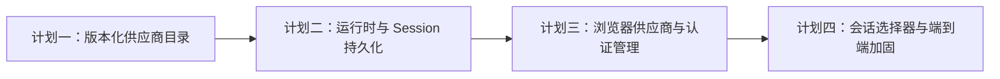

# 浏览器模型供应商与模型管理实施路线图

> **For agentic workers:** REQUIRED SUB-SKILL: Use superpowers:subagent-driven-development (recommended) or superpowers:executing-plans to implement this plan task-by-task. Steps use checkbox (`- [ ]`) syntax for tracking.

**Goal:** 按可验证、可回滚的增量，把本地现有供应商、认证、自定义模型和会话模型切换能力完整接入 Remote Control 浏览器界面。

**Architecture:** 本地 Worker 继续作为供应商配置、凭据和实际运行时的权威；RCS 只缓存脱敏目录并持久化环境默认引用与 Session 模型快照；浏览器通过结构化命令管理本地状态。四份实施计划严格顺序执行，每份都必须在进入下一份前通过自己的测试门禁。

**Tech Stack:** TypeScript、Bun、Zod、React、Hono、SQLite、WebCrypto/Node Crypto、Claude Code SDK control protocol。

## 全局约束

- 当前工作树已有大量未提交修改。实施前必须使用 `superpowers:using-git-worktrees` 检查隔离方式；任何提交只包含本计划列出的文件。
- 每个行为变更先写失败测试，再写最小实现，再执行目标测试和相邻回归测试。
- 不把 API Key、Bearer Token、OAuth Token、Helper 输出或云凭据写入 RCS 数据库、事件、Capability、日志或测试快照。
- 不复用 `settings.availableModels` 保存用户目录；它继续只表示托管允许列表。
- 不删除旧版 `set_model`、旧版 Provider 数组或旧 Worker 路径；新能力全部由 capability gate 增量启用。
- 修改供应商默认值不得修改任何已存在 Session；Session 只有在收到 Worker 的权威成功确认后才更新模型快照。
- 所有新增用户可见文案使用中文；协议字段、错误码和持久化列名保持英文。

## 实施顺序



### 计划一：供应商目录和配置基础

文档：[2026-07-14-provider-catalog-foundation.md](./2026-07-14-provider-catalog-foundation.md)

交付物：

- `providers.json` v2 Schema、旧数组内存迁移和显式保存升级。
- 供应商/模型 CRUD、软归档、Revision、Operation ID 幂等和默认模型约束。
- 现有 settings/env 登录状态检测与脱敏目录。
- `provider_model_catalog_v1` capability 快照。

进入下一阶段的门禁：Provider Registry 全部测试、根目录 typecheck、脱敏扫描通过。

### 计划二：运行时激活和 Session 持久化

文档：[2026-07-14-provider-runtime-session-persistence.md](./2026-07-14-provider-runtime-session-persistence.md)

交付物：

- 不可变 `ProviderRuntimeSnapshot` 和按 Session 隔离的子进程环境。
- SQLite Session 模型字段、创建时默认快照、Work 协议传递和重连恢复。
- `set_session_model` 结构化控制、失败回滚和 `session_model_changed` 校准。
- 兼容规则进入生产请求路径，相关客户端/模型缓存可精确失效。

进入下一阶段的门禁：RCS 持久化/Work、Bridge、SDK control、模型 API 测试和 typecheck 通过。

### 计划三：浏览器供应商和认证管理

文档：[2026-07-14-browser-provider-auth-management.md](./2026-07-14-browser-provider-auth-management.md)

交付物：

- RCS 结构化环境命令与浏览器 API。
- 按环境隔离的供应商/模型 CRUD、验证、归档、启用和设默认页面。
- Claude/ChatGPT OAuth、兼容 API Key/Bearer、Gemini/Grok 和云凭据状态入口。
- 一次性 Secret Control 加密通道和重放/过期/日志脱敏测试。

进入下一阶段的门禁：环境命令、API、页面、OAuth 状态机和 Secret Control 安全测试通过。

### 计划四：会话模型选择和发布加固

文档：[2026-07-14-browser-session-model-switching.md](./2026-07-14-browser-session-model-switching.md)

交付物：

- 会话控制栏使用可搜索、按供应商分组的动态目录。
- 新建会话显示将使用的默认模型，旧会话保留最后成功模型。
- 流式输出期间禁止切换，权威事件确认、冲突和失败回滚。
- 旧 Worker 降级、重启恢复、双环境隔离和密钥泄露端到端验收。

完成门禁：四份计划的全部目标测试、根目录 `bun run typecheck`、RCS typecheck、浏览器构建和验收脚本通过。

## 设计覆盖矩阵

| 设计要求 | 负责计划 | 权威验收点 |
|---|---|---|
| 全部供应商、认证与自定义模型可配置 | 一、三 | 脱敏目录 + 浏览器向导 |
| 每环境一个默认模型 | 一、三 | Revision 化 `defaultModel` |
| 新 Session 复制创建时默认值 | 二、四 | Session SQLite 快照 + Work payload |
| 旧 Session 保持最后模型 | 二、四 | 重启/重连恢复测试 |
| 同/跨供应商切换 | 二、四 | `set_session_model` + 运行时快照 |
| 归档不破坏历史引用 | 一、四 | 软归档 + 不可用历史项 |
| 认证沿用本地现有实现 | 一、三 | Headless auth facade |
| RCS 永不持有明文密钥 | 三、四 | Secret Control + 泄露扫描 |
| 旧 Worker 可继续使用 | 二、四 | capability gate + legacy `set_model` |
| 并发修改与重复投递安全 | 一、二、三 | expected revision + operation result cache |

## 每阶段共同验证

在每份计划的阶段提交前运行：

```bash
git diff --check
bun run typecheck
bun run --cwd packages/remote-control-server typecheck
```

预期：三条命令都以退出码 `0` 完成；工作树中的既有无关错误必须先记录基线，不能归因或顺手修改。

## 阶段提交规则

- 每个任务使用计划中给定的窄范围 `git add`，不得执行 `git add .`。
- 每个阶段至少一个可独立回滚的提交；安全协议、数据库迁移和 UI 分别提交。
- 阶段结束使用 `superpowers:requesting-code-review`；全部实现完成后使用 `superpowers:verification-before-completion` 和 `superpowers:finishing-a-development-branch`。
